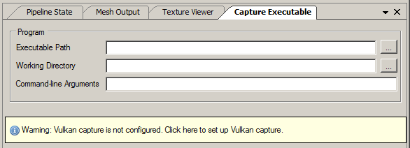

Vulkan Support
==============

This page documents the support of Vulkan in RenderDoc. This gives an overview of what RenderDoc is capable of, and primarily lists information that is relevant. You might also be interested in the :doc:`full list of features <../getting_started/features>`.

The latest information and up-to-date support is always available on the `GitHub wiki <https://github.com/baldurk/renderdoc/wiki/Vulkan>`_.

Vulkan capture
--------------

RenderDoc's Vulkan support uses the sophisticated layering mechanism built into the Vulkan API. This means that once RenderDoc has registered its capture layers, there is no need for invasive process hooking - we can simply launch the target process with an environment variable set.

The one requirement of this however is that the layer does need to be registered in an OS specific way - on windows this is in the registry, on linux this is in ``/usr/share/vulkan/implicit_layer.d``, ``/etc/vulkan/implicit_layer.d``, or ``$HOME/.local/share/vulkan/implicit_layer.d``. That way the Vulkan loader can scan and initialise the layer.

Usually this will happen for you if you install RenderDoc with a proper installer, or update from a previous version. However if you are compiling RenderDoc yourself or running a loose unzipped build, the capture panel will show a warning indicating that the layers need to be registered. Just click this and the registration will be applied.

    Vulkan Layer Registration

Performance notes
-----------------

Vulkan is intended as a high-performance low CPU overhead API, and RenderDoc strives to maintain that performance contract at a reasonable level. While some overhead is inevitable RenderDoc aims to have no locks on the 'hot path' of command buffer recording, minimal or no allocation, and in general to have low performance overhead while not capturing.

Some patterns of access are more or less conducive to good performance on RenderDoc, so if you are having trouble with slow capture, large memory/disk overhead or slow replay you might want to try eliminating use of persistent maps of memory from coherent heaps - you can use ``vkFlushMappedMemoryRanges`` to emulate non-coherent heaps and RenderDoc will take advantage of that, or you can use non-persistent maps.

Likewise try to avoid making very large memory allocations in the range of 1GB and above. By its nature RenderDoc must save one or mor copies of memory allocations to enable proper capture, so having allocations limited to only a few 100s of MBs can help gain granularity of management and limit the memory overhead RenderDoc adds. There may be optimisation of this in future on RenderDoc's side but there are no easy guarantees.

Current support
---------------

RenderDoc has initial support for Vulkan at the launch of version 1.0, but it contains some caveats. In addition, not all replay features are currently supported, but this is being actively worked on.

* RenderDoc assumes that even if multiple GPUs are present, that only one VkDevice and one VkQueue will be created and used.
* RenderDoc captures will in general not be portable between different systems, only currently supporting capture and replay on the same or similar enough machines.
* Sparse textures are only supported for non-arrayed 2D textures with no mips.
* Pixel history is not implemented.
* Shader debugging is not currently supported.
* Mesh output of geometry/tessellation shader stages is not available.

Non-windows platforms
---------------------

Linux and other pltaform support follows naturally when thinking about Vulkan support. There is full support for capturing and replaying on linux, with the UI based on Qt. It is also possible to capture on another platform, and then replay on windows or windows. For more information on this see :doc:`../how/how_network_capture_replay`.

See Also
--------

* :doc:`../getting_started/features`
