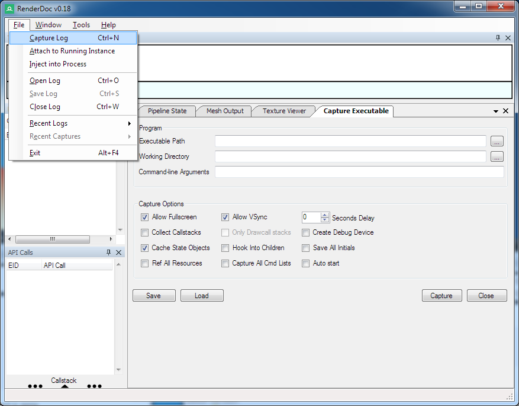
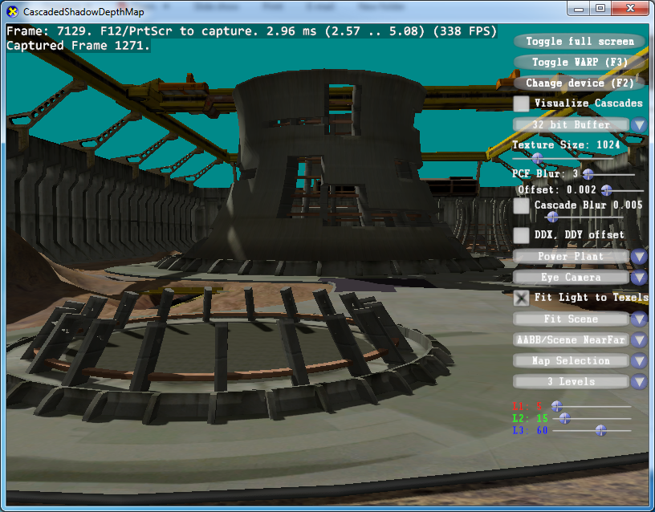
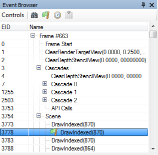
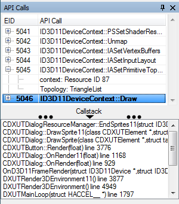
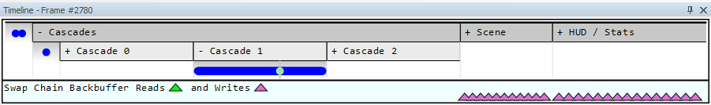
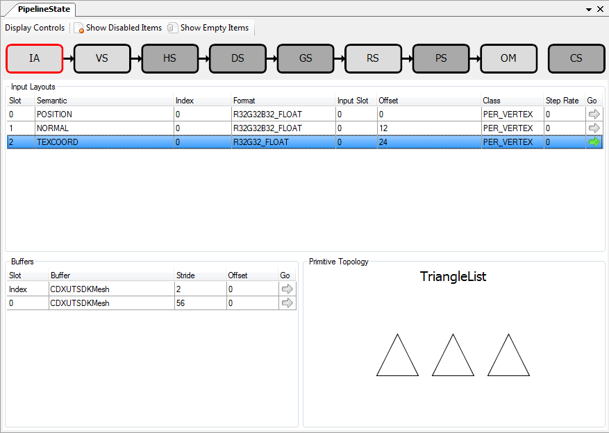
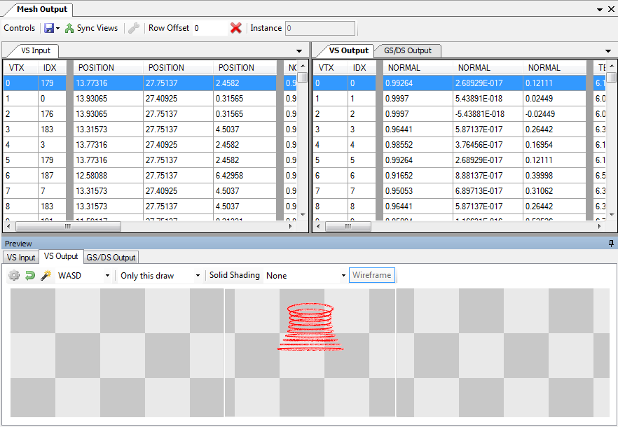

Quick Start
===========

This document serves as a brief introduction to how to use RenderDoc to capture and analyse your application. It doesn't go into much detail about exactly what functionality is available for digging into things, as this can be found elsewhere. Instead it focuses on just the workflow from start to finish and roughly where to look for different things.

For this tutorial we will be using the `debugmarker <https://github.com/SaschaWillems/Vulkan#vk_ext_debug_marker>`_. sample from `Sascha Willems' Vulkan samples repository <https://github.com/SaschaWillems/Vulkan>`_..

Capturing a frame
-----------------

To capture a frame, begin by selecting :guilabel:`File` → :guilabel:`Launch Application`. By default this will open a new docked window where you can configure different settings that will be used when capturing. You may find this window is already available.



    Launching an executable

The defaults work pretty well in most situations, so you can just either browse to or drag in your exe into the Executable box. If the working directory box is empty then the executable's directory will be used. Enter any command line you may need and click Launch to launch the application with RenderDoc.

More details of the specific options and their functionality can be found in the details page for the :doc:`../window/capture_attach`.


.. note::

    You should choose the build of RenderDoc to match your OS - 64-bit for Windows x64 and vice-versa

    You can only capture a 64-bit process with a 64-bit build of RenderDoc. A 32-bit process can be captured by either build of RenderDoc.

RenderDoc in-app
----------------

RenderDoc has a fairly minimal in-app overlay, just to indicate that RenderDoc has successfully loaded and is ready to capture a frame.


When ready, press the Capture Key (:kbd:`F12` or :kbd:`Print Screen`) and the next frame after the keypress will be captured, and this will show up on the overlay to let you know that a frame has been successfully saved.



    The in-application RenderDoc Overlay

When the application exits, if you captured a frame it will automatically start to open in the RenderDoc UI. If you didn't capture a frame then nothing will happen and the RenderDoc UI will be back as it was when you clicked Launch.


If you made multiple captures you will see a thumbnail list that allows you to open (in the current instance or a new instance to compare side-by-side), save and delete them as you wish. You can also access this view while the program is still running, see :doc:`../window/capture_connection` for more information on taking multiple frame captures. Note however that for the simple use-case, you don't need to worry about this!

RenderDoc layout
----------------

RenderDoc's layout can be customised fairly heavily so this section will only cover the default layout. We'll go over the windows that are open by default and how each can be used in analysing your program.


Each of these windows has a section that is much more in depth and gives details about every function and feature, for the more complex windows such as the texture viewer you may well wish to skim these to get an idea of what is available and use them as reference in the future.

Texture Viewer
``````````````

.. figure:: ../imgs/QuickStart/QuickStart3.png

    The Texture Viewer

More details can be found on the :doc:`../window/texture_viewer` page.

The texture viewer does pretty much what you'd expect - it allows you to inspect textures and render targets in your application.

There are various visualisation controls that allow you to select different channels, mip levels or other aspects of the texture, and more detail is available in the above page. Here we'll just touch on the highlights:

* The thumbnail strip (by default to the right) lists either the output targets, or shader inputs bound and used at present. Selecting each of these (the red outline on the thumbnail indicating which is selected) will follow whatever resource is bound to that slot as you browse through the scene.

  E.g. if you select render target 0 then the texture display will update to show the currently bound render target 0 regardless of which texture that is. If the slot you are following becomes unbound or unused, the previous texture will still be displayed up until you select a different pipeline slot, or the slot is bound again. Unbound texture slots show up with *Unbound* listed under their thumbnail.

  To open a specific texture and watch it even as it changes slots or becomes unbound, you can open it in a new locked tab. Double click on it, right click on it and 'open in new locked tab', or :doc:`open it by name <../how/how_view_texture>`.

* The format and dimensions of the texture are displayed on the status bar just below the texture display itself.
  Also on this status bar you can see the current pixel co-ordinate that you are hovering over, as well as the 'picked' pixel value which can be inspected by right clicking anywhere on the texture display.

* Further to this, there is a small zoomed section of context around the last picked pixel available in the bottom right of the texture viewer window. From here you can also launch the pixel history or debugger, as detailed in :doc:`../how/how_debug_shader`.

* The last thing we will highlight is the range control. This is a fairly flexible tool that allows you to adjust the visible range in the image. This is particular useful when viewing HDR images with a range outside of *[0, 1]*.

  To use the range control you can drag the white and black points to make fine adjustments or type values to change the values of the white and black points (by default 0 and 1 respectively). There are also some useful controls to the right of the range control itself, which are detailed again in the :doc:`../window/texture_viewer` page.

Event Browser
`````````````



    The Event Browser

More details can be found on the :doc:`../window/event_browser` page.

.. |timeline_marker| image:: ../imgs/icons/timeline_marker.png

The Event Browser is the primary method of stepping through the frame and browsing the events that occurred within. The first column EID (Event ID) indicates which event or API call this was in the frame, chronologically. Events which are listed here are generally output/draw type events, including Clears. Copy and Map type calls are not included and are available in the API Calls view (see below).

The columns can be customised and reordered, the |timeline_marker| select columns button (or right-click) will allow you to choose which columns are displayed.

Standard performance markers are available and create the hierarchy/labels as you would expect. These can be expanded or collapsed and keyboard browsing is available through normal controls - left and right go higher or lower in the hierarchy, and up and down goes up and down through siblings.


.. |find| image:: ../imgs/icons/find.png
.. |asterisk_orange| image:: ../imgs/icons/asterisk_orange.png

The 'current' event - i.e. the event at which we are inspecting the graphics state - is highlighted with a green Flag |flag_green| and the row is highlighted. As any row is selected it immediately becomes the new current event.

While the Event Browser is selected, you can press the shortcut keys :kbd:`CTRL-F` or :kbd:`CTRL-G` to find |find| or jump to a given EID |flag_green| respectively.


The |asterisk_orange| bookmark button will allow you to bookmark an event, the shortcut key is :kbd:`CTRL-B`.

A list of bookmarked events will show up on a toolbar at the top of the event browser, they and the shortcut keys :kbd:`CTRL-1`  to :kbd:`CTRL-0` will jump to the respective bookmarked EID. These shortcuts will work anywhere in the application.

Bookmarks can be saved with the capture and shared with others. For more on this see the :doc:`../how/how_annotate_capture` page.

API Inspector
`````````````



    The API Calls + Callstack Panel

More details can be found on the :doc:`../window/api_inspector` page.

The API Calls window updates as a new event is selected. It shows the individual API calls and their parameters between the previous and current event. The bottom entry in this list always corresponds to the event that is currently selected, and each row can be expanded to show the parameters that were passed to that API call.

At the bottom of the window is an optional expandable section which shows the callstack (if available and recorded) from the application code into the API function.


In order to view these callstacks you must first resolve the symbols recorded with the capture. To do this click on :guilabel:`Resolve Symbols` under the :guilabel:`Tools` menu. More details on this process can be found in the guide: :doc:`../how/how_capture_callstack`.

Timeline Bar
````````````



    The Timeline Bar

More details can be found on the :doc:`../window/timeline_bar` page.

The timeline bar is essentially an alternate view of the frame, with the horizontal axis being time in the frame. The horizontal axis is scaled evenly by API calls, such that every API call has the same width at any given zoom level.

The frame marker hierarchy is top-down in this case, and can be expanded or collapsed by clicking on each section. In this image, "Render Scene" and "Toon shading draw" are both expanded, but the other sections remain collapsed. Each drawcall is rendered as a blue pip underneath the section of the hierarchy that it is a child of. The current drawcall (if visible) is rendered as a green circle.

There is a vertical line around the current drawcall, as well as a |flag_green| above, and a gray outline around the event where the mouse is hovering.

When the currently selected texture is used in the frame, each drawcall that references it draws a marker below the bar. The different colours of marker indicate whether the drawcall at that point is writing to the texture, reading, both reading & writing simultaneously, etc. If the markers are too close together they will space themselves to be readable and will not necessarily line up to a particular drawcall unless you zoom in.

This can be a very useful tool to trace data through a frame, as well as highlighting potential redundancy or errors if a target is being written to where it should not.

Pipeline State
``````````````



    The Pipeline State Viewer

More details can be found on the :doc:`../window/pipeline_state` page.


The Pipeline State window is perhaps the most detailed but also the simplest to understand. This window simply lists every stateful aspect of the graphics pipeline and what value or object is present at the current event.

.. |go_arrow| image:: ../imgs/icons/action_hover.png

By default the pipeline will not contain empty or unused entries - i.e. if a shader only reads from resources 0 and 1, even if something is bound to slot 2 it will not be displayed. Likewise say slots 3-128 are empty - they will also not be displayed. This behaviour can be modified by the :guilabel:`Show Unused Items` and :guilabel:`Show Empty Items` toggles on the toolbar. Show Unused will show slot 2 even if the shader does not read from it. Show Empty will show slots 3-128. This behaviour varies significantly by API since the shader binding model is often quite different.

One important thing to note is that most things in the sections for each pipeline stage can be expanded to view in more detail. Look for the Go Icon (|go_arrow|) to indicate that a more detailed view is available. Typically this will mean for shaders the shader source/disassembly will be opened, for texture-type resources the texture viewer will open a new tab for that resource, and for buffers it will open either the Mesh Viewer window, a raw view of that buffer, or a popup with the constant contents - depending on where the buffer is bound.

.. |link| image:: ../imgs/icons/link.png

Another useful convention is that anywhere an API object is mentioned, its name is written in *bold* followed by a |link|. This is a clickable link to the :doc:`../window/resource_inspector` window which allows you to examine in more detail how the object is defined and what other API objects it is linked to.

For more details, check out the how-to: :doc:`../how/how_object_details`.

Mesh Viewer
```````````



    Mesh Viewer

More details can be found on the :doc:`../window/buffer_viewer` page.

.. |arrow_undo| image:: ../imgs/icons/arrow_undo.png
.. |cog| image:: ../imgs/icons/cog.png

Mesh Viewer allows you to inspect the geometry data as it passes through the pipeline. Both raw data in a grid view and 3D inspection is possible. The tabs in the preview window allow you to choose at which part of the pipeline you'd like to visualise the data.

By default the preview shows a wireframe rendering of the mesh, but you can choose solid shading options. This can either be simple shading or use a secondary attribute as color. Right clicking on any column allows you to choose the secondary attribute for rendering.

You can also select which attribute is the position, in case either the auto-detection failed or you want to visualise another attribute like texture co-ordinates in 3D space.

You can hold or click the right mouse button on the mesh preview to select the vertex in the mesh data tables.

The default view for final vertex output data (which you can reset to with the reset button |arrow_undo|) shows the camera at the view origin looking out through the viewport. By default the output attempts to guess a perspective matrix from the output data, but this can be refined or changed to an orthographic view by opening up the options |cog| and entering more accurate or corrected values.

Closing Notes
-------------

Obviously what you accomplish in the program will vary a lot by what you need to investigate, but hopefully this gives you an overview of the functionality available. There are many more detailed features that are available, and the rest of this help will aid you in finding those.

It is probably a good idea to check out the :doc:`tips_tricks` page which lists several useful notes that aren't obvious but might save you a lot of time.
