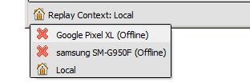
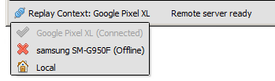
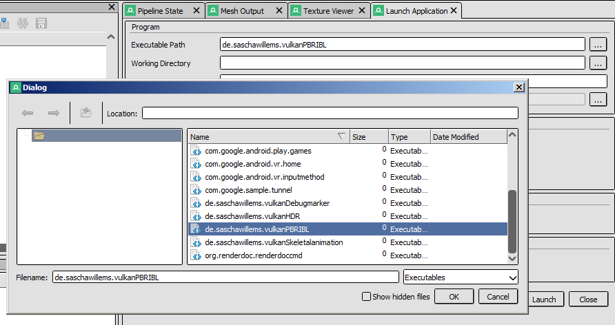

How do I use RenderDoc on Android?
==================================

RenderDoc contains support for Android for both Vulkan and OpenGL ES. It requires a couple of extra steps more than capturing on a desktop computer, but generally the workflow is very similar.

The Android device must be running at least Android 6.0.

Android support is still quite new, so if you run into any rough spots please `open an issue on GitHub <https://github.com/baldurk/renderdoc/issues/new>`_ or `email me <mailto:baldurk@baldurk.org?subject=RenderDoc%20on%20Android>`_.

.. caution::

  For RenderDoc's android support, your package must be installed and it **must be debuggable**.

Quick start
-----------

Android is supported by using :doc:`Remote Contexts <../how/how_network_capture_replay>` to debug applications on your device from a host computer. To begin, look at the bottom left of the normal RenderDoc UI to see the remote context selection dropdown:

By default when you start up, this is set to "Local" which means all capture and replay happens on the host computer. To switch to a connected android device, click the drop-down and select your device from the options:

.. note::

  If you don't see your android device listed, try waiting a few seconds as available devices are scanned every so often.

.. |cross| image:: ../imgs/icons/cross.png

Each device listed will likely have a |cross| next to it, indicating that RenderDoc's capture & replay app is not yet running on the device. Select a device, and RenderDoc will check that RenderDoc's app is installed and run it.

.. note::

  After the app is installed once, it will not need to be reinstalled until you update your version of RenderDoc.

Once RenderDoc's app is running, you are ready to capture and replay on android, and the drop-down will indicate the new active connection.

You can now use the RenderDoc UI as normal, and the entire workflow is exactly the same as you are used to on desktop, except that the capture and replay will happen on the selected android device. For example, when you click browse for an executable to run, it will list the installed packages.

If your package is not debuggable, you will not generally be able to capture it with RenderDoc. Instead build a development copy of your package that has the debuggable flag. In UE4 this is done by unchecking "For Distribution" and in Unity this is done by building a "Development Mode" build.

Then once connected, you can trigger captures and open them as normal.

Avoiding timeouts on certain packages
-------------------------------------

If your package can take a long time to startup, you can go to the :doc:`settings window <../window/settings_window>` under the :guilabel:`Android` section and increase the :guilabel:`Max Connection Timeout`.

Troubleshooting
---------------

RenderDoc assumes your device is already configured for debugging. Check that it appears in ``adb devices``. `See here <https://developer.android.com/studio/run/device.html>`_ for instructions on how to configure that.

If you have Android Studio open, it will interfere with RenderDoc's debugging by attaching to the package itself. Either close it or disable adb integration in "Tools → Android → Enable ADB integration".

RenderDoc does its best to locate or provide necessary android tools. On windows, these tools are shipped with the distributions and all that's required is java - either in your ``PATH`` or via the ``JAVA_HOME`` environment variable. If these tools aren't present then RenderDoc searches through ``PATH`` and other variables like ``ANDROID_HOME`` or ``ANDROID_SDK_ROOT`` to find the SDK. If you don't have those variables set, you can browse to the SDK and JDK folders in the :doc:`settings window <../window/settings_window>` under the :guilabel:`Android` section.

If something goes wrong with these steps, please `open an issue on GitHub <https://github.com/baldurk/renderdoc/issues/new>`__! The process should be as smooth as possible given Android's platform limitations, so if you encounter problems then it may well be fixable.

Often when an operation fails, more information is available via :guilabel:`Help` → :guilabel:`View Diagnostic Log`.
