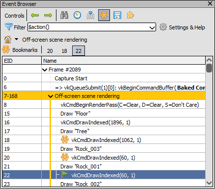

How do I annotate a capture?
============================

RenderDoc allows annotation of captures in two ways - annotations that you provide from your application along with the other graphics API calls that you make, and annotations that are made in the UI while analysing a capture and can be saved with it.

The annotations provided with the graphics API calls from your application vary by the particular API and are documented below.

Annotations made in the UI are also described below. These can be useful for example when investigating a bug or repro case and passing on your findings natively to someone else, instead of having to include additional text like 'texture 148 is the buggy texture' you can directly mark up the capture.

All of the UI modifications can be saved with a capture. Pressing :kbd:`Ctrl-S` or :guilabel:`File` → :guilabel:`Save` will save the capture with any changes that have been made to it in the UI. If you haven't already saved a temporary capture, or the capture is on a remote context, this will need to you save it to a local path.

Application provided marker regions
-----------------------------------

When calling graphics API functions from your code you can provide annotations to group regions of the frame under names, with a nested hierarchy.

These markers are provided in an API specific way: D3D11 uses the ``D3DPERF`` or ``ID3DUserDefinedAnnotation`` APIs, D3D12 uses ``SetMarker``/``BeginEvent``/``EndEvent`` on lists or queues, OpenGL has many extensions but ``KHR_debug`` is guaranteed to always be available, and Vulkan uses ``VK_EXT_debug_utils``.

In APIs such as D3D12 and Vulkan with queues and command buffers, the markers are processed in submission order and are allowed to cross primary command buffers, so a single region can cross several command buffers. Secondary command buffers or bundles can contain markers but they must be self-contained and not imbalanced.

Some of the APIs add the ability to provide a colour for a marker region, these colours are displayed in the :doc:`../window/event_browser` window.

.. figure:: ../imgs/Screenshots/EventBrowserRegions.png

	Marker Regions: The Event browser showing several coloured marker regions.

Example code for D3D11:

.. highlight:: c++
.. code:: c++

  // The ``D3DPERF`` APIs are exported by ``d3d9.dll``, but can still be used in D3D11
  // for compatibility reasons

  D3DPERF_BeginEvent(0xffffffff, L"Start of example");

  D3DPERF_BeginEvent(0xff00ff00, L"Sub section");
  // events inside the subsection
  D3DPERF_EndEvent();

  // events outside the subsection
  D3DPERF_EndEvent();

  // the newer ID3DUserDefinedAnnotation API is also supported
  ID3DUserDefinedAnnotation *annot;
  immediateContext->QueryInterface(__uuidof(ID3DUserDefinedAnnotation), (void **)&annot);

  annot->BeginEvent(L"Sub section 2")

  annot->EndEvent();

Example code for D3D12:

.. highlight:: c++
.. code:: c++

  // 1 for the first parameter means the data is an ANSI string. Pass 0 for a wchar string.
  // the length should include the NULL terminator
  list->BeginEvent(1, "Begin Section", sizeof("Begin Section"));

  list->EndEvent();

  // queue-level markers can be provided similarly.

Example code for OpenGL using the ``KHR_debug`` extension. Many other extensions exist in GL to provide markers and will be made available by RenderDoc too.

.. highlight:: c++
.. code:: c++

  // omitted code to initialise the extension function pointers

  glPushDebugGroupKHR(GL_DEBUG_SOURCE_APPLICATION, 0, -1, "Begin Section");

  // contents of section here

  glPopDebugGroupKHR();

Example code for Vulkan using the ``VK_EXT_debug_utils`` extension:

.. highlight:: c++
.. code:: c++

  // omitted code to initialise the extension

  VkCommandBuffer cmd = ...;

  VkDebugUtilsLabelEXT markerInfo = {};
  markerInfo.sType = VK_STRUCTURE_TYPE_DEBUG_UTILS_LABEL_EXT;
  markerInfo.pLabelName = "Begin Section";
  vkCmdBeginDebugUtilsLabelEXT(cmd, &markerInfo);

  // contents of section here

  vkCmdEndDebugUtilsLabelEXT(cmd);

  // queue-level markers can be provided similarly.

Application provided object names
---------------------------------

Similar to the marker regions above, it is possible to give objects names via the graphics APIs and they will be displayed with those human-readable names instead of auto-generated names.

When a resource with a custom name is bound to the pipeline it will be listed like so:

.. figure:: ../imgs/Screenshots/NamedTex.png

	Named Texture: The example texture bound with name displayed.

In a similar way any other resource can be named and this will be useful throughout the rest of the analysis. If a custom name is not provided, a default name will be generated - as seen above with the Render Pass and Framebuffer objects.

Again the exact method varies by API, as given in the examples below.

.. note::

  RenderDoc does not support names that change within a capture. A resource only has one name, which is the most recent one set.

Example code for D3D11 using the ``SetPrivateData`` function:

.. highlight:: c++
.. code:: c++

	// Creating an example resource - a 2D Texture.
	ID3D11Texture2D *tex2d = NULL;
	d3dDevice->CreateTexture2D(&descriptor, NULL, &tex2d);

	// Give the texture a useful name
	tex2d->SetPrivateData(WKPDID_D3DDebugObjectName, sizeof("Example Texture"), "Example Texture");

With D3D12 you can use the ``SetName`` function:

.. highlight:: c++
.. code:: c++

	// Creating an example resource - a 2D Texture.
	ID3D12Resource *tex2d = NULL;
	d3dDevice->CreateCommittedResource(&heapProps, heapFlags, &descriptor, initState, &clearValue, __uuidof(ID3D12Resource), (void **)&tex2d);

	// Give the texture a useful name
	tex2d->SetName(L"Example Texture");

In OpenGL this can be done with ``GL_KHR_debug`` with the function ``glObjectLabel``.

.. highlight:: c++
.. code:: c++

  // Creating an example resource - a 2D Texture.
  GLuint tex2d = 0;
  glGenTextures(1, &tex2d);
  glBindTexture(GL_TEXTURE_2D, tex2d);

  // apply the name, -1 means NULL terminated
  glObjectLabel(GL_TEXTURE, tex2d, -1, "Example Texture");

In Vulkan you can enable the ``VK_EXT_debug_utils`` extension, which is provided by RenderDoc, and use the ``vkSetDebugUtilsObjectNameEXT`` function.

.. highlight:: c++
.. code:: c++

  // create the image
  VkImage tex2d;
  vkCreateImage(device, &createInfo, NULL, &tex2d);

  // set the name
  VkDebugUtilsObjectNameInfoEXT nameInfo = {};
  nameInfo.sType = VK_STRUCTURE_TYPE_DEBUG_UTILS_OBJECT_NAME_INFO_EXT;
  nameInfo.objectType = VK_OBJECT_TYPE_IMAGE;
  nameInfo.objectHandle = (uint64_t)tex2d; // this cast may vary by platform/compiler
  nameInfo.pObjectName = "Off-screen color framebuffer";
  vkSetDebugUtilsObjectNameEXT(device, &nameInfo);

Bookmarks
---------

.. |asterisk_orange| image:: ../imgs/icons/asterisk_orange.png

The event browser allows you to make bookmarks on events of particular interest. This allows quick navigation of a frame or jumping back and forth between two events that may be quite separated.

The |asterisk_orange| bookmark button will allow you to bookmark an event, the shortcut key is :kbd:`Ctrl-B`. Once you have several bookmarks, you can jump between them by pressing the :kbd:`Ctrl-1` to :kbd:`Ctrl-0` shortcuts from anywhere in the UI, without any need to focus the event browser.

	Bookmarks bar: The bookmarks bar with several EIDs bookmarks.

When loading any capture with saved bookmarks they will be automatically populated into the UI. This will allow you to highlight particular problematic events and anyone opening the capture will be able to use the shortcuts above to jump immediately to where the problem is.

Resource Renaming
-----------------

From within the :doc:`../window/resource_inspector` window, you can rename any resource in the capture. Whether the resource already had a custom-specified name, or if it had a default-generated name, you can provide overrides at any time.

To do so, simply select the resource in question in the resource inspector - either by clicking a link from where it is bound, or searching for it by name or type. Then click on the :guilabel:`Rename Resource` button next to the name, and it will open an editing textbox to let you change the name. When you've set the name, press :kbd:`Enter` or click :guilabel:`Rename Resource` again. To cancel a rename, press :kbd:`Escape` or click :guilabel:`Reset name` to restore the name to its original value.

.. figure:: ../imgs/Screenshots/resource_rename.png

	Resource Inspector: Renaming a resource in a capture.

As with bookmarks, these renames can be saved with a capture and are automatically used when loading the capture subsequently. This can be useful to point the way to which resources are causing problems, or specifically how a given resource with a more general name is being used in this particular capture.

Capture Comments
----------------

In the :doc:`../window/capture_comments` window there is a simple text field allowing you to store any arbitrary text you want within the capture. This could be notes on the environment or build version that was stored.

By default, any capture that is newly opened that contains comments will show those comments first and foremost when opening. This behaviour can be disabled in the :doc:`../window/settings_window`.
