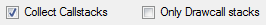
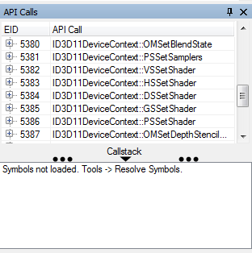
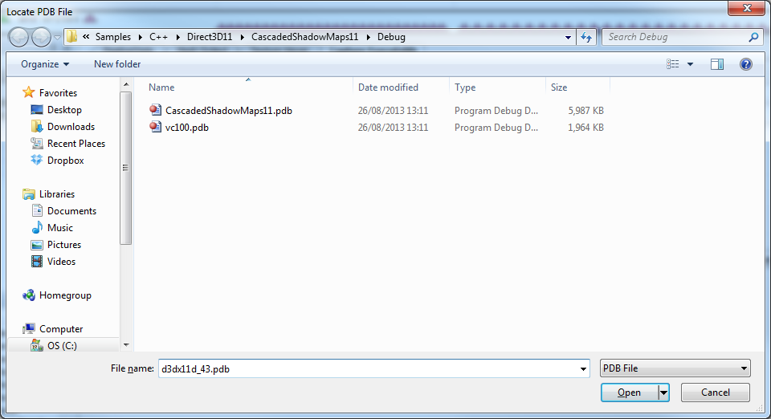

How do I capture callstacks?
============================

This page gives an overview of the callstack-capturing capability in RenderDoc, with details and important information about how to enable this.

Overview
--------

It can be useful when tracking down problems to have an idea of where each API call came from. In any non-trivial program it's not necessarily obvious where every single call was made, and giving a code-side callstack up to the API entry point can pinpoint errant calls that are causing problems.

.. warning::

	On Windows the callstack gathering uses ``dbghelp.dll``. If you're using this dll for some other debugging functionality in your app it is highly recommended that you disable it, otherwise it can conflict and break RenderDoc's callstack capture.

.. note::

	Callstack gathering has a reasonable overhead during capture and can slow things down as well as cause more memory overhead. This can be mitigated with the 'only drawcall callstacks' option that only lists callstacks for each drawcall event.

Launching Capture
-----------------

When launching a capture (as in :doc:`how_capture_frame`) you should enable :guilabel:`Collect callstacks`. This will set RenderDoc to collect callstacks at every API entry point that will be serialised into the capture file.

	Collect Callstacks: Option enabled on the capture dialog.

If you wish to save some time & overhead you can then enable :guilabel:`Only drawcall stacks`. This will only collect callstacks when a drawcall-type API call is made. This can be a good-enough trade off that still gets you the information you need, at a lower cost. After this point you can run the program and capture as usual.

Replaying the capture
---------------------

When the capture is loaded in RenderDoc the callstacks will be available in the API inspector. The bottom section of the dialog is a panel that can be expanded to show the callstack. Initially this section will indicate that symbols need to be resolved.

	Callstack section: The callstack section expanded in API inspector.

To resolve the symbols referenced in the capture, go to the :guilabel:`Tools` menu and select :guilabel:`Resolve Symbols`. If this menu option isn't available the callstacks did not successfully collect in the capture file.

The resolving symbols process may take some time the first few instances you use it, as it may have to download symbols from the Microsoft symbol server. Each module that is loaded in the application at the time of capture will be saved and its symbols searched for.

By default a symbol server will be used, as well as a few default locations such as the location indicated in the PE metadata (i.e. the original build location). If a pdb cannot be found you will be prompted for the location of the pdb, and this new location will then be remembered for subsequent pdbs.

	PDB locate prompt: Prompt to locate a PDB that cannot be found.

If a PDB cannot be located then you have the option of permanently ignoring that PDB. This can be useful for third party libraries for which no PDB will ever be available. If you don't ignore the PDB you will be prompted to locate it the next time you open a capture that references it.

Once the symbols have been successfully resolved the callstack section of the API inspector will contain any callstack that was collected for the given drawcall or API call. You can select and copy any levels and paste them elsewhere if you wish.
