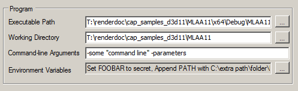
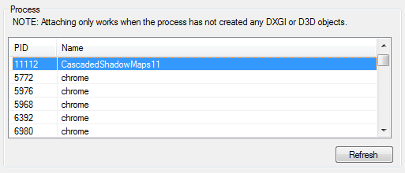

How do I capture a frame?
=========================

Capturing frames is the starting point to using RenderDoc. Although the basic use is very simple, there are various customisations and more advanced uses. More information on these can be found in the details of the :doc:`../window/capture_attach` window.

Capturing frames
----------------

The basic process of capturing frames is fairly straightforward.

Opening the launch application window from the menus via :guilabel:`File` → :guilabel:`Launch Application`, the typical capture setup simply requires you to enter the executable location.

By default the working directory remains empty and defaults to the directory that contains the executable location.

	Capturing: Launching an executable specifying its path and command line.

Likewise, the default options generally work well for most situations, however you can look at the details of each option in :doc:`../window/capture_attach`.

Injecting into a Process
------------------------

.. warning::

	The important thing to note about injecting is that RenderDoc can only inject to processes that **have not initialised or used the target API**. If this is the case RenderDoc can insert its hooks before any use of the API and work as normal. If the API has already been used or initialised the results are undefined and likely RenderDoc will simply not function as it's too late to hook in.

It is possible to inject to an already running process as long as it hasn't yet initialised a graphics API. By selecting :guilabel:`File` → :guilabel:`Inject to Process`, the capture dialog will modify to list the running processes rather than asking for an executable and command line parameters.

This can be useful if launching your application from a single exe is non-trivial and it's easier to inject into the process after it has been launched.

	Injecting to a selected existing process.

.. note::

	If RenderDoc is not running as administrator, it cannot inject into processes that are running with elevated permissions. In this case you can either run RenderDoc as administrator (not recommended unless necessary), or re-run the process as the normal user running RenderDoc.

Capture settings
----------------

Commonly in development, the capture parameters don't change. In fact most likely the same application or couple of applications are launched in exactly the same way repeatedly as development iterates.

To make this process easier RenderDoc supports saving and loading configuration sets to a file. While on the capture dialog, click 'Save' to save to a ``.cap`` file which contains both the executable path, working directory and command line - as well as the options that are selected.

This ``.cap`` file can be executed when RenderDoc's file associations are set up, and RenderDoc will load this file and present you with the capture dialog on startup.

You can also use the "Auto start" option - when this option is enabled then a .cap file will immediately launch the program when it is loaded. This can allow you to configure a .cap which will open RenderDoc and launch the target application with the pre-configured settings in one click. If you wish to disable this, just uncheck the option and re-save to the same ``.cap`` file.

See Also
--------

* :doc:`../window/capture_attach`
* :doc:`how_network_capture_replay`
