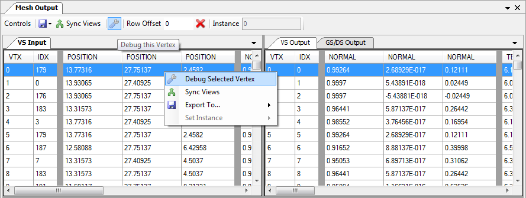
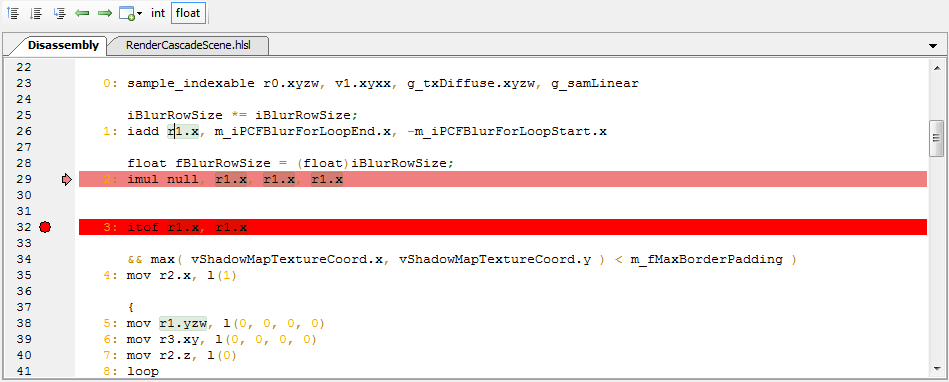
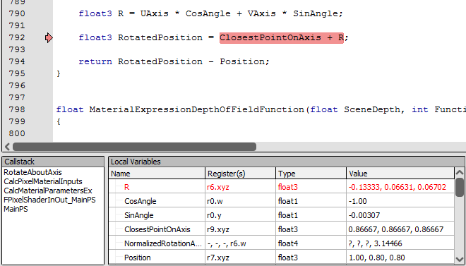
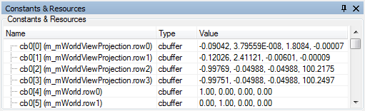
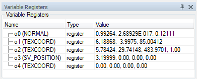
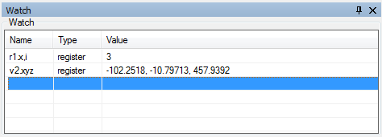

How do I debug a shader?
========================

This page goes into detail about how to set up your captures for debugging shaders, as well as how to debug a shader and what controls are available.

.. warning::

   Shader debugging is currently only supported in D3D11. On other APIs the debug options listed below will either be hidden or disabled.

Including debug info in shaders
-------------------------------

For the most part at least some debug information is included with shaders unless it is being explicitly stripped out at some point. There is usually an option to also include additional debug information - such as original source code in a high-level language. The exact process varies by API, but for D3D11 the flag ``/Zi`` to fxc or the equivalent flag to ``D3DCompile()`` will include additional debugging information, and ``/Qstrip_debug`` and ``/Qstrip_reflection`` will remove reflection information that can be useful - such as the names of variables in constant buffers.

For shader debugging it's recommended that you build with ``/Od`` or ``D3DCOMPILE_SKIP_OPTIMIZATION``, as this will enable HLSL debugging by default.

For more information on how to get this unstripped debug information to renderdoc, see :ref:`unstripped-shader-info`.

Debugging a vertex
------------------

Vertex debugging is invoked from the mesh viewer. With the mesh viewer open you can select the input vertex you wish to debug.

When a vertex is selected in the mesh data for the vertex input it will be highlighted along with the primitive it is part of in the mesh display, provided the display is in vertex input mode.

Right click and choose debug vertex from the context menu.

	Vertex Debugging: Launching vertex debugging from the mesh viewer.

From here the debugger will open with the vertex shader in the shader debugger. The inputs are automatically filled in from the mesh data.

.. note::

	Geometry and tessellation shaders are not yet debuggable.

Debugging a Pixel
-----------------

Pixel debugging is launched from the texture viewer. For more details on selecting the pixel to debug see :doc:`how_inspect_pixel`.

When a given pixel is selected you can click the history button underneath the pixel context. This will launch the :ref:`pixel-history` window with the selected pixel showing every modification. You can then choose to debug any of the triangles that generated a change.

If you already have the current drawcall selected that you want to debug, you can click the debug button to skip the pixel history and jump straight to the debugger. The inputs to the pixel will be automatically filled in.

There are a couple of things to note while pixel debugging:

* If the drawcall selected doesn't write to the pixel you have highlighted, the pixel history window will open to let you choose which draw call to debug.
* If a drawcall overdraws the same pixel several times then the results of debugging will come from the last fragment that passed the depth test. If you wish to choose a particular fragment from the list then first launch the pixel history and choose which fragment to debug from the list there.

Debugging a Compute thread
--------------------------

To debug a compute thread simply go to the compute shader section of the pipeline state viewer and enter the group and thread ID of the thread you would like to debug. This thread will be debugged in isolation with no other threads in the group running.

This means there can be no synchronisation with any other compute thread running and the debugging will run from start to finish as if no other thread had run.

.. warning::

	This feature is **highly** experimental and is provided with no guarantees yet! It may work on simple shaders which is why it is available.

Debugging Controls
------------------

When debugging, at the moment the controls are fairly basic.

	Shader controls: Controls for stepping through shaders.

The toolbar at the top gives controls for the program flow through the shader.

|runfwd| Run and |runback| Run Backward simply run from the current position all the way through to the end or start of the program respectively. The keyboard shortcuts for these controls are :kbd:`F5` and :kbd:`Shift-F5` respectively.

You can set a breakpoint by pressing :kbd:`F9` (this will also remove a breakpoint that is already there). When running in each direction or to cursor (see below) if execution hits a breakpoint it will stop.

.. |runsample| image:: ../imgs/icons/control_sample_blue.png

|runsample| will run to the next texture load, gather or sample operation, and stop as if a breakpoint had been placed on that instruction.

|runnaninf| will run to the next operation that generates either a NaN or infinity value instead of a floating point value. This will not apply to operations that produce integer results which may be NaN/infinity when interpreted as float.

.. |stepnext| image:: ../imgs/icons/control_play_blue.png

|stepnext| Step forward will execute the current instruction and continue to the next - this includes following any flow control statements such as jumps, loops, etc.

|stepprev| Step backwards will jump back to whichever instruction lead to the current instruction. This does not necessarily mean the previous instruction in the program as it could be the destination of a jump. Stepping forwards and stepping backwards will always reverse each other.

The shortcuts for these commands are :kbd:`F10` and :kbd:`Shift-F10`

|runcursor| will run to the cursor. This will perform in a similar fashion to the "Run" command, but when it reaches the line that the cursor highlights it will stop and pause execution. It will also stop if it reaches the end of the shader. The shortcut for this is :kbd:`Ctrl-F10`

.. note::

	The highlighted instruction at any given point indicates the *next* instruction to be executed - not the instruction that was just executed.

Hovering over a register in either the disassembly or in the view windows will open a tooltip showing the value in different interpretations.

There is also a toggle available to control the 'default' interpretation of temporary register values - float or int. D3D registers are typeless but typically they are interpreted as float values. With this toggle you can toggle them to be interpreted as integers by default instead.

HLSL Debugging
--------------

When debug information is available in the shader, RenderDoc allows debugging at the HLSL level. This is activated by default if the shader was built with optimisation disabled, but as long as debug information is available you can toggle between assembly and HLSL debugging at any time.

In the toolbar there will be a 'Debug in HLSL' button when HLSL debugging is available, and similarly in reverse a 'Debug in Assembly' button. You can also right-click and select 'Go to Disassembly' or 'Go to Source'.

While source debugging, the same controls are available to set breakpoints, run forwards and backwards, etc. Note that stepping and running in HLSL may skip over several assembly instructions at once.

Debug information also includes HLSL callstack and locals mapping, which allows RenderDoc to display the function callstack at the current instruction and the name and values of any local variables that are in scope. They are displayed in the callstack and locals windows respectively.

	Callstack and Locals windows.

.. note::

	Callstack and local mapping information is only available with windows 8.0 and later versions of fxc. That corresponds to ``D3DCompiler_47.dll``.

Debugging Displays
------------------

There are two windows that display different types of registers. The constants window will display input and constant buffer registers that are immutable throughout execution. This will also list registers for resources and samplers (with basic format information).

	Constants window: Constant, input and resource registers.

The other window will contain variable/mutable registers. These contain temporaries that are typically allocated up front and will update as you step through the execution of the shader. This window also contains the output registers.

	Registers window: Variable registers - temporaries and outputs.

The final window is initially empty but can be filled out as needed. This shows custom watch expressions and their values. Here you can write any expression involving an input, temporary or output register along with a swizzle and typecast. When debug information is present you can also include locals here.

Swizzles follow the standard hlsl rules - ``.[xyzw]`` or ``.[rgba]`` in any permutation or repetition will show those channels.

The custom typecast can be any of ``,x`` ``,i`` ``,d`` ``,f`` ``,u`` ``,b`` to display the register as hex, signed integer, double, float, unsigned, or bitwise respectively.

	Watch window: Watch window - custom register expressions evaluated.
