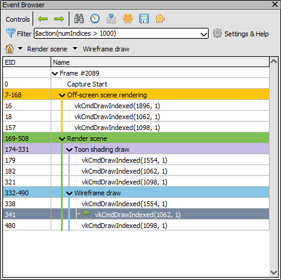
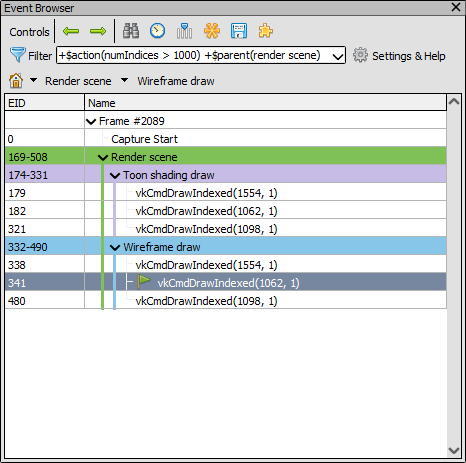
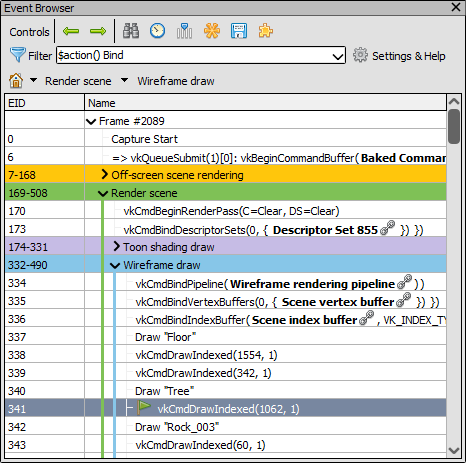
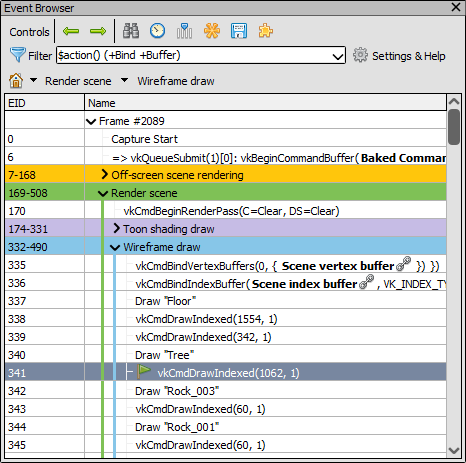
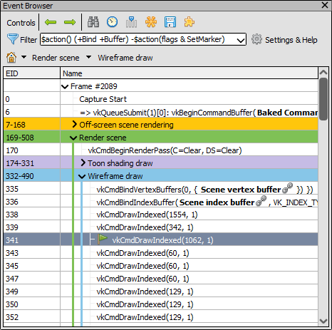
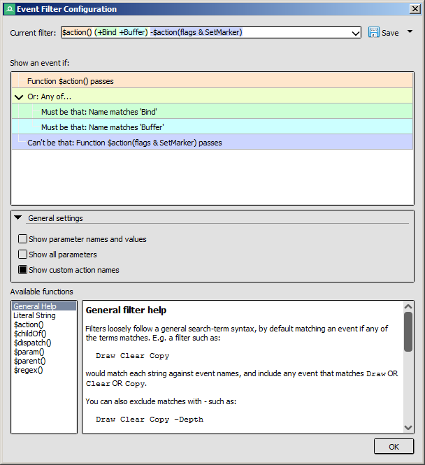

How do I filter visible events?
===============================

The :doc:`Event Browser window <../window/event_browser>` allows you to browse through the frame by changing the current event, and seeing a list of events in the capture organised into a user-defined hierarchy of markers (for more information on how to provide these markers, see :doc:`how_annotate_capture`).

By default the events which are listed are those known as actions. Draws and dispatches are examples of actions, but also events that modify resources like clears and copies. State setting and other CPU-update calls like Maps are not included and are listed in the :doc:`API Inspector <../window/api_inspector>`.

With event filters you can control which events are displayed, to include or exclude them based on substrings or more complex filters.

Filter Expressions
------------------

At the most basic level filters act like a search query across all the events in a capture. If several terms are given together:

.. code:: text
    
    Draw Clear Copy

This will include any event that matches any one of these terms. For example ``DrawIndexed()`` and ``Draw()`` would both match ``Draw`` and so would be displayed even if they don't match ``Clear`` or ``Copy``. ``Dispatch()`` would be filtered out because it doesn't match any of these terms.

You can also exclude specific terms by prefixing them with a ``-``:

.. code:: text
    
    Draw Clear Copy -Depth 

Which will still display ``DrawIndexed()`` and ``Draw()`` as before, as well as for example ``ClearColor()``. However ``ClearDepth()`` would be filtered out because it matches the ``-Depth`` term.

If you don't want to have all terms be optional, you can instead require specific terms:

.. code:: text
    
    +Draw +Indexed -Instanced

This requires that events **must** match ``Draw`` and ``Indexed`` and **must not** match ``Instanced``. This means ``DrawIndexed()`` would be displayed because it satisfies all terms, but ``Draw()`` would now be filtered out because although it matches ``Draw`` it does not match ``Indexed``. Similarly ``DrawIndexedInstanced()`` would be filtered out because while it matches both required terms, it also matches the excluded term.

.. warning::
    If you have some required terms like this then any optional terms are completely ignored. ``+Draw -Instanced`` would match the same events as ``+Draw Dispatch -Instanced``. This is because an event will be included only if it matches the required term and excluded if it doesn't, there's no room for an optional match.
    
    This is unlike a more flexible search which can use optional terms to weight some results higher than others, since events are always listed in their explicit order.

Filters can also be nested with parentheses, for example if you wanted to require at least one of several matches:

.. code:: text
    
    +Draw +(Indexed Instanced) -Indirect

Which requires that events **must** match ``Draw``, and **must** match at least one of ``Indexed`` or ``Instanced``.

Filter functions
----------------

The examples above all used simple string matching, which can be enough for many cases but sometimes a more complex query is desired. For this reason there are filter functions, which can query properties with more flexibility.

The default filter is an example of this, the ``$action()`` filter function will match any action - draws, dispatches, copies, clears, etc.

.. figure:: ../imgs/Screenshots/EventsDefaultDisplay.png

	Default Display: The Event browser with the default event filter applied.

The ``$action()`` filter function can also take parameters, for example here we will filter for only actions which are draws with over 1000 indices or vertices:

	Filtered Display: The Event browser with only draws containing more than 1000 indices.

Other filter functions are available, for example ``$parent(...)`` will match events that have a given marker as a parent, so we could filter to only the draws in the scene and not in the off-screen pass:

	Filtered Display: The Event browser with only draws containing more than 1000 indices underneath the 'Render Scene' marker.

Notice how we changed the filter to require both ``$action(numIndices > 1000)`` as well as ``$parent(render scene)``. If we didn't, we would include all draws with 1000 vertices as well as all events under Render Scene - which isn't what we wanted in this case.

.. note::

    As seen above, any marker regions which don't have any included child events (recursively) will be hidden entirely.

There are many other filter functions and it is also possible to register custom filter functions as a python extension, you can explore the available functions and their documentation in the filter settings menu.

Example
-------

We'll give another real world example of how to selectively include or exclude events. Starting with the same case as above:

.. figure:: ../imgs/Screenshots/EventsDefaultDisplay.png

	Default Display: The Event browser with the default event filter applied.

We want to see when bindings are changed in addition to the draws. To do this we'll add ``Bind`` as an optional term:

	Actions and binds: The filter including binding calls as well as actions.

Now we can see the pipeline and vertex/index buffer binds that happened before the first drawcall. In this case there aren't other binding changes between the later drawcalls visible.

Let's say that we only care about buffer bindings and want to exclude the pipeline bind. We could do this by adding a ``-Pipeline`` term, but we might then have to exclude other types of bindings and that could get tedious. Instead we'll change the bind term to ``(+Bind +Buffer)`` which will only match events that contain ``Bind`` and ``Buffer``. Since the term itself is optional, this still means actions are included.

.. note::
    This could be accomplished another way such as usuing a regular expression, but for the sake of example we'll do it like this.

	Actions and binds: The filter narrows to include only buffer binding calls.

Now we can see the buffer binding calls as well as the actions that we wanted. At this point we might find that the markers setting object names are a little too noisy, so we want to exclude them. Since there isn't necessarily a common substring with these object names we can instead exclude all markers by type. Markers are a type of action, so we can match against the action flags containing the flag indicating a set marker.

	Actions and binds: The final filter, excluding set markers from the previous filters.

Finally we have the filter expression matching only the events we want. We can further include/exclude events as we wish in a similar way, or we could save this filter for later in the settings window if this is a filter we will want to have available regularly.

Filter settings
---------------

The filter settings window contains an explanation of the current filter and what it matches against, as well as ways to save/load filters, and documentation for the available filter functions.

	Filter settings: The filter settings window, showing the example query above explained.

At the top the filter is editable in the same way as in the main Event Browser, and once parsed it will be highlighted showing each term corresponding to the explanation in the panel below.

.. |save| image:: ../imgs/icons/save.png

The filter can be saved by pressing the |save| Save button. By giving the filter a name you can then re-select this filter in future. Changes to filters are only applied when explicitly saving them here, if you select a filter and edit it then those changes will not be saved.

You can also export or import the whole set of filters here with the save drop-down menu. This will overwrite your current set of filters.

At the bottom there is documentation similar to here about how the filter syntax works and in particular for each of the available filter functions how they work and what parameters they support.