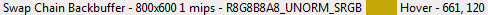
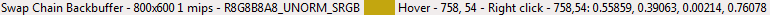
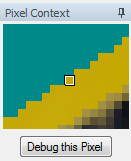

How do I inspect a pixel value?
===============================

When in the texture viewer you can inspect the pixel values to obtain the exact contents of any pixel in the texture.

Selecting appropriate subresource
---------------------------------

More details can be found in the :doc:`../window/texture_viewer` page, but the first step is to select the appropriate subresource - array element, cubemap face or mip slice.

The values that are picked out of the texture are always exact values, and will not be affected by the currently selected channels or range adaption control.

Picking a Pixel Value
---------------------

At any point while hovering over the texture the status bar contains the current pixel location that the cursor is hovering over, as well as a basic color swatch to give some indication of where you are.

	Hover Status Bar: The status bar showing position and color

When the right mouse button is pressed, the currently hovered pixel value will be displayed with the current float precision settings - for more information on how to tune these look at the window reference for the :doc:`../window/settings_window`.

For depth textures the depth and stencil values will be displayed separately. The stencil value (as with any integer formatted texture) will be displayed as an integer.

	Picked Pixel: The value of a pixel that has been picked

If the right mouse button is just clicked, the picked pixel value will remain with the same value as the mouse moves. If you hold the right mouse button and drag, it will update as the mouse moves to allow some amount of refinement.

To make fine adjustments by a single pixel at a time, it's easiest to use the arrow keys on the keyboard. Pressing these will shift the picked location by a single pixel in each direction.

Pixel Context Display
---------------------

Whenever a pixel is picked, the pixel context display is updated to surround the currently selected pixel. This dialog is by default docked in the bottom right of the texture viewer, next to the thumbnail strip.

	Pixel Context: The zoomed in context around the pixel currently selected

This context display shows a zoomed in view of the texture around the area that you've selected so that it's easier to make small adjustments without zooming in and losing a sense of the whole texture.

The pixel context viewer can also allow you to launch pixel debugging, if the API supports it. Once a pixel is picked the button below the context is activated which will launch the shader debugger. More information about this is available: :doc:`how_debug_shader`.

It also allows you to launch a pixel history view if supported, showing every modification to this pixel in the frame up to the current point.

.. _pixel-history:

Pixel History
-------------

When you have a pixel selected, you can click 'History' to open up a pixel history view showing every modification to the selected texture from the start of the frame to the currently selected event.

This display shows each modifying event as its own row, colored as to whether any modifications happened from this event or not - green for fragments that passed all pipeline tests, red for where fragments failed some test, and light gray for arbitrary shader writable resources where it's unknown if there was a write.

You can expand each event to see if there were multiple fragments, and see the shader output value from each fragment.

Right clicking will allow you to launch the shader debugger at the given event for the selected pixel. If you select a particular fragment or primitive, this will be the fragment that is debugged.

See Also
--------

* :doc:`../window/texture_viewer`
