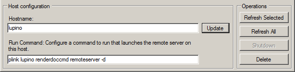
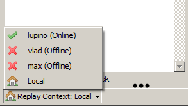
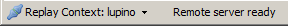
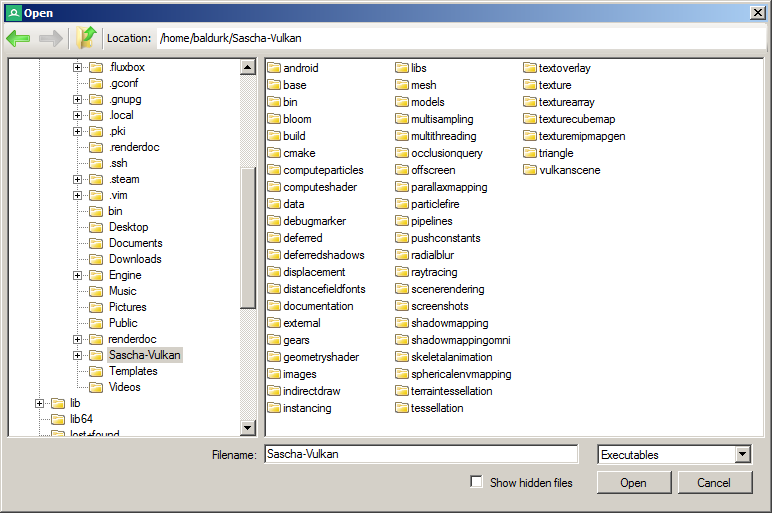
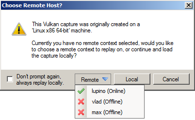

How do I capture and replay over a network?
===========================================

RenderDoc supports capture and replay over a network connection. While slightly more complicated than the default workflow of doing everything on one machine, there are a number of scenarios where this can be useful.

This is also the same mechanism used for Android capture and replay, except with built-in native support for supporting Android targets.

If you can run the minimal RenderDoc support for capturing on a target machine such as an embedded device or devkit, the bulk of the replay work can be done on an existing machine where the UI is running.

Likewise if you have a capture that you'd like to run on a different driver or hardware, you don't have to set up a full environment to run RenderDoc, you can just run the minimal remote server.

Overview
--------

RenderDoc's network support has the core concept of a "Replay Context".

By default you are in the "local" replay context. All operations happen relative to your own machine - from executables that you launch, to how replays are processed and instantiated. This is the familiar process, where you browse and launch executables on a machine and all the replaying happens locally.

To use a remote machine, you define a replay context for that machine. Everything else works exactly the same way, but executables are run on that machine and captures are replayed on that machine.

Configuring Remote Hosts
------------------------

To configure a remote host, open the manager by opening the :guilabel:`Tools` menu and select :guilabel:`Manage Remote Servers`.

.. figure:: ../imgs/Screenshots/RemoteHostManager.png

	Remote Hosts: Configuring remote hosts for replay contexts.

This manager allows you to configure both which remote hosts are available, as well as starting and stopping the "Remote Server" on that host.

To add a new host, simply type its hostname in the hostname box and click ``Add``. It will be added to the list of known remote hosts, and immediately a network lookup will happen to see if the remote server or any running RenderDoc-injected applications are alive.

At minimum, this is all you must configure. However it is recommended that you configure a command which can be run on the **local** machine which will **remotely** start the remote server on that host. The reason for this is that it allows easy capture each time with zero manual extra steps.

	Remote Hosts: Configuring the properties of a remote host.

To configure such a command, enter it under the "Run Command" box and click ``Update``. If you haven't added the host yet, you can fill out both boxes at once and click ``Add``. This command runs under the context of the host with the UI, and is an arbitrary command. When the remote server is needed, RenderDoc will run this command to attempt to launch it without needing any manual intervention.

The remote server can be run with the command ``renderdoccmd remoteserver``. The exact syntax may depend on your operating system, see ``renderdoccmd remoteserver --help`` for more information, you might want to use the ``-d`` parameter to make the remote server run in the background instead of pausing interactively.

.. note::

  If you are running on linux, it might be worth configuring the DISPLAY environment variable here - that way it will be inherited by every executable that the server runs. Otherwise you would have to configure the environment variable each time when capturing.

.. warning::

	Note that by default the remote server listens to all private IPs, and will allow any connection from those IPs to run commands as the remote server's user without authentication. See later in this document for configuration options to limit the vulnerability this poses.

If a run command is configured you can also manually run the server from this window, as well as shut it down. The remote server is not shut down even when the host UI closes, so the only way to shut it down are either manually from the host itself, or via this window.

An example for this for linux would be to use ``plink.exe`` and passwordless key authentication to run the command on a linux machine:

.. code::

    plink.exe user@host DISPLAY=:0.0 renderdoccmd remoteserver -d

Assuming that plink.exe is in ``PATH`` on the host machine, and ``renderdoccmd`` is on the host machine.

Switching to a Replay Context
-----------------------------

Once a remote context is configured, you can switch to it in the bottom left of the status bar. This is only possible when there is no capture currently open.

	Replay Context status: Switching to a remote replay context

The drop-down will show you which remote hosts you have configured are currently already running a remote server, with periodic refreshes. When a remote host is selected, RenderDoc will attempt to connect. If it fails to find an active server but a run command is configured it will execute the command to try and launch the remote server.

If you don't have a run command configured, this is where you would need to launch the server manually. The server can be left running indefinitely until you want to stop it, as it will continue to live on after the UI closes.

	Replay Context status: Status of a remote replay context

The status bar will show the current status of the replay context - whether the remote server could be reached, or if it was busy (as it can only be used for one user's active replay context connection at a time). Likewise if the remote server unexpectedly goes away (e.g. because it was killed remotely, or due to network problems) then the status bar will show that too.

Working in a remote replay context
----------------------------------

By and large, working in a remote replay context is designed to be transparent to the user. All the familiar operations and workflows will work as expected, perhaps with some small decrease in responsiveness that comes with a network connection's added latency and possible lower specifications of the target system.

In the :doc:`../window/capture_attach` window the file and directory browsing is by definition relative to the replay context you are working in. For this reason, a custom dialog is used to display the contents of the remote filesystem instead of the default system dialog for browsing the local computer.

	Remote Hosts: Browsing the file system within the remote replay context

Likewise, any environment variables set will be relative to the target system's environment and will not inherit anything from the host's system. Specifically, the remote server is used to execute all target programs so the environment will be inherited from it.

Capture files will all be kept on the target system by default. They will only be copied back to the host machine when you explicitly save the file to a path. Otherwise they will be owned by the remote server, and cleaned up as appropriate.

.. note::

  There is a case where temporary captures can be 'leaked' and not cleaned up. If you do not have a remote server run command configured and have captures left over when the program closes, there will be no way to either save or delete the temporary log files. This *doesn't* apply to deleting or saving captures while the program is still running.

  The capture connection will warn you about this case and let you know when you are leaking temporary captures - you can delete them by hand if necessary, or you can switch to a replay context on that host and then you will be able to save and delete them as normal.

  Note that this is the same as if a program is run locally without any connection to the UI made at all - the captures will leak with nothing left to take ownership of them. The difference is that if a connection is made, because the files are on the local machine they can be deleted or saved directly by the UI even after the program has closed.

Capture files made with a recent version of RenderDoc will store a coarse type of machine that was used at capture time, such as 'Linux 64-bit' or 'Windows 32-bit'. If you have the local replay context active and the machine you are running on differs significantly from the machine that the capture was made on, the UI will prompt you to ask if you really want to replay it locally (which may or may not work depending on the API and contents of the log), or switch to a remote context.

	Remote Hosts: Prompting for remote replay of a notably different log

Configuring the Remote Server
-----------------------------

The remote server can be configured by a file in ``~/.renderdoc`` or ``%APPDATA%/renderdoc`` called ``remoteserver.conf``. This allows you to restrict which IPs can connect to the server, as well as whether execution is allowed.

To whitelist an IP range, add a line such as this:

.. code::

    whitelist 192.168.0.0/16

Which will allow any IP ``192.168.x.x`` to connect. When the remote server starts, it prints the IP ranges it will allow. If no IP ranges are configured, it will by default listen to all private ranges - ``10.0.0.0/24``, ``192.168.0.0/16``, and ``172.16.0.0/12``.

To prevent the server from ever executing any commands regardless of whether the IP is allowed, add a line such as this:

.. code::

    noexec

This will prevent any execution from happening under any circumstances. Note that if you do this, you will have to launch renderdoc-injected commands another way and the workflow described in this document will not work as-is.

The file also allows blank lines and comments beginning with ``#``.

See Also
--------

* :doc:`../window/capture_connection`
* :doc:`../window/capture_attach`
