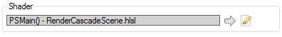
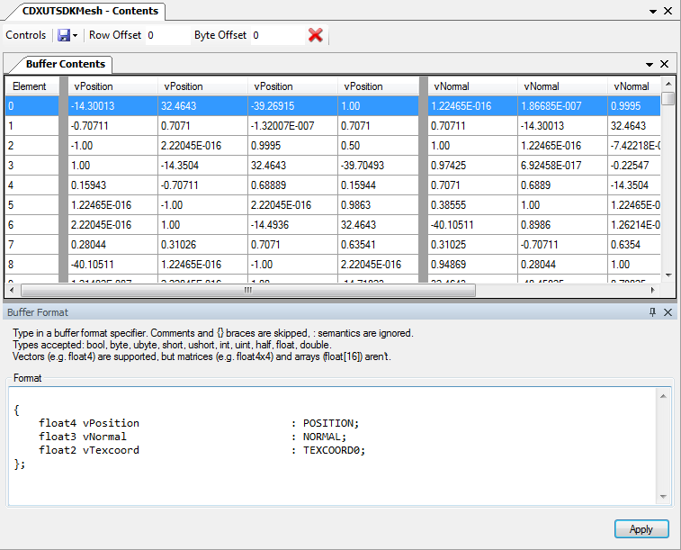
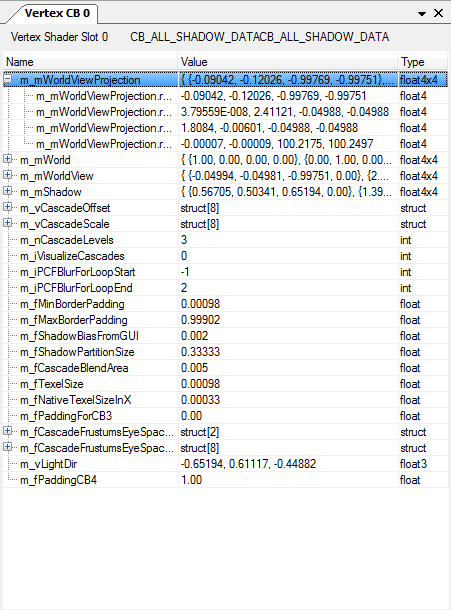

How do I view details of an object?
===================================

.. |goarrow| image:: ../imgs/icons/action_hover.png
.. |link| image:: ../imgs/icons/link.png

The pipeline state viewer allows you to view more details of given resources that are bound to the pipeline. The go arrow |goarrow| is a sign that more details for this resource are available.

Resources that are written in **bold text** with a |link| are clickable links that lead to the :doc:`../window/resource_inspector` with more information about a given resource.

Viewing Shaders
---------------

Each shader stage that is active on the pipeline can be expanded to see both the high-level shader language and the low-level disassembly. At the top of the pipeline stage there is a box showing the currently bound shader - by its entry point if known.

	Bound Shader: Box showing the currently used shader.

Much of the information that is available from the shader is only available when debugging information is made available. :doc:`More details are available separately <how_debug_shader>`.

Each file passed to the compiler for this the shader is shown with simple syntax highlighting, as well as the disassembly generated from the bytecode itself.

If available, the reflection data from the shader debugging information will be used in other areas of the pipeline state viewer. It will be used for naming texture slots, showing which resources that are bound are to be used in the shader, as well as showing the names of any constants that are used in the shader.

When this shader reflection information is available it will be integrated into the disassembly to make it easier to read.

.. |page_white_edit| image:: ../imgs/icons/page_white_edit.png

Note from here you can also :doc:`live-edit a shader <how_edit_shader>` by clicking the edit button |page_white_edit|.

Viewing Textures
----------------

The :doc:`../window/texture_viewer` is the primary way of viewing details of textures, so this section concerns itself with how textures are displayed in other parts of the UI, and how to open a texture in the texture viewer. More details can be found in :doc:`how_view_texture`.

A texture that is bound to the pipeline as a resource or output the relevant section of the pipeline will display their dimensions and format. In each place the go arrow |goarrow| will indicate that a new locked tab can be opened up in the texture viewer.

In addition to opening a new view of the texture, the timeline bar will also show the usage of this texture - a green triangle will indicate a place where the texture is written to, and a green triangle indicates a read operation. More details are available on the :doc:`../window/timeline_bar` page.

Viewing Buffers
---------------

More details on this section are available on the :doc:`../window/buffer_viewer` page.

When opened either from the vertex input section the pipeline state view, or from the :guilabel:`Window` menu under :guilabel:`Mesh Viewer`, the buffer viewer opens up in the mesh viewer mode. This is a specialisation of the buffer viewer which will show a 3D display of the mesh represented, as well as viewing the mesh buffers at different points in the pipeline.

In the general case, buffers bound to the pipeline can be opened as a raw buffer viewer. This will open up a view of the buffer similar to the mesh viewer, but with a completely customisable buffer layout.

By default if the buffer is bound to the pipeline with a pre-existing structure that can be reflected from the shader then this will be the default, otherwise the default layout will be 4 32bit unsigned integers per element.

This layout can be customised by entering a format in a simple style that mimics defining a structure that outlines a single element in the buffer.

	Custom Buffer Layout: Customising the layout of the buffer by defining a structure.

.. note::

	This window supports copy and paste, so simply select the entries and ctrl-c to copy to the clipboard

Viewing Constant Buffers
------------------------

Constant buffers can be viewed by clicking on their Go Arrow |goarrow|. This will open up a new docked section to the right of the pipeline state viewer that tracks that constant buffer slot.

Whenever this shader slot has a constant buffer in it, both the constant names and types as well as values will be displayed.

	Constant Buffer: An updating preview of the contents of this constant buffer.

.. note::

	This window supports copy and paste, so simply select the entries and ctrl-c to copy to the clipboard
