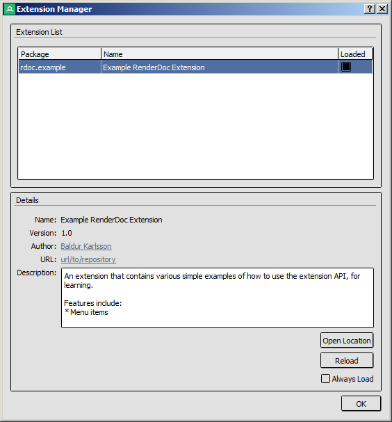

How do I write a python extension?
==================================

RenderDoc supports python extensions using the :doc:`existing python API <../python_api/index>`. These extensions can be configured to be persistent and load whenever the RenderDoc UI does, allowing users to extend the program with custom functionality.

Creating extensions
-------------------

Extensions are simply python modules located in the user's RenderDoc config folder, with a json manifest. The config folder varies by platform, on Windows it's ``%APPDATA%\qrenderdoc\extensions`` and on linux it's ``~/.local/share/qrenderdoc/extensions``. Each extension is a python module subfolder under this root. You can nest subfolders, e.g. ``extensions/foo/bar/first`` would be the extension ``foo.bar.first``, and treated independently from ``extensions/foo/bar/second``.

Next to each python module's ``__init__.py`` you should create a file ``extension.json`` following this template:

.. highlight:: json
.. code:: json

    {
        "extension_api": 1,
        "name": "Extension name for users",
        "version": "1.0",
        "minimum_renderdoc": "1.2",
        "description": "A longer description of your extension.\n\nIt can contain multiple lines",
        "author": "Your name <your@email.com>",
        "url": "url/to/repository"
    }

In this JSON the ``extension_api`` field is currently fixed to 1.

The ``minimum_renderdoc`` field controls whether the extension can be enabled on a given RenderDoc version, and allows you to block incompatible versions of RenderDoc.

The ``name``, ``description``, ``version``, ``author`` and ``url`` fields are all informational and presented to users when listing installed extensions.

Without this json manifest the extension will not be enumerated by RenderDoc and displayed to users.

Enabling extensions
-------------------

To configure installed extensions, open the extension manager by opening the :guilabel:`Tools` menu and select :guilabel:`Manage Extensions`.

	Extension Manager: Configures installed extensions.

From here a list of all installed extensions is presented. By default extensions are not loaded, to load an extension either select it and press :guilabel:`Load` or else tick the box in the :guilabel:`Loaded` column in the list. As with python modules, once loaded an extension cannot be unloaded until the program is restarted.

Once an extension is loaded to enable it permanently, tick the :guilabel:`Always Load` checkbox when the extension is selected. Once enabled this means the extension will always load when the UI starts without any user interaction. Extensions must be loaded first to ensure they can load without errors or crashes before enabling them to load at startup.

A loaded extension can be reloaded by pressing the :guilabel:`Reload` button which will attempt to unload and load the extension again to refresh the code. This may break so if you encounter any problems it's recommended that you restart the program to ensure a clean reload.

Writing extensions
------------------

A python extension when loaded will have a ``register`` function called in its module, and such a function must exist at global scope. It's defined like so for Extension API v1:

.. highlight:: python
.. code:: python

    def register(version, pyrenderdoc):
        # version is the RenderDoc Major.Minor version as a string, such as "1.2"
        # pyrenderdoc is the CaptureContext handle, the same as the global available in the python shell

Optionally you can define an ``unregister`` function to be called if the extension is reloaded. This takes no parameters and is simply an opportunity to clean-up or remove anything persistent that shouldn't hang around, before ``register`` is called again.

Extensions use the full :doc:`python API <../python_api/index>` with all of the power that comes with it. There are interfaces geared specifically towards extensions in :doc:`the qrenderdoc module <../python_api/qrenderdoc/extensions>` which allow registering callbacks for menu items.