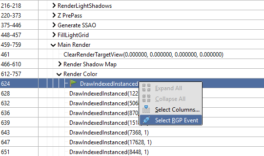
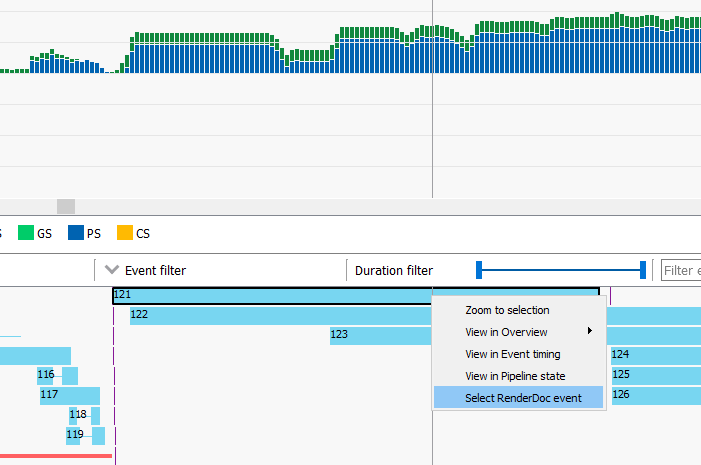

How do I generate an RGP profile?
=================================

RenderDoc has integration with AMD's Radeon GPU Profiler. This allows you to generate an RGP profile from a RenderDoc capture, embed the profile in the capture file, and synchronise the view of the frames between RenderDoc and RGP.

Enabling RGP integration
------------------------

By default the RGP integration is disabled. To enable it go to the :guilabel:`Settings` window and in the :guilabel:`Core` section enable :guilabel:`Enable Radeon GPU Profiler integration`.

Generating a profile
--------------------

To begin you will need to go to the :guilabel:`Tools` menu and select :guilabel:`Create new RGP Profile`. If this menu option isn't available, you need to have the latest AMD drivers installed on your machine.

Selecting this menu item will open a small popup and spend a few second creating the profile itself. After the profile is created, the RGP profiling tool will automatically open up.

.. note::

    If you haven't configured the path to the RGP tool, you will be prompted to here. Once the path has been configured successfully the tool will open.

Opening a previously created profile
------------------------------------

After generating a profile above, the RGP data is embedded in the ``.rdc`` file.

Since RGP can open a profile on any machine without needing AMD drivers or hardware, this embedded RGP profile can be opened at any time by going to the :guilabel:`Tools` menu and select :guilabel:`Open RGP Profile`.

The RGP tool will open just the same as if the profile was newly created.

Correlating information between RenderDoc and RGP
-------------------------------------------------

If using RGP version 1.2 or higher, once both tools are open they have a synchronised view of the underlying data.

This means that within RGP you can select an event, right click and choose :guilabel:`Select RenderDoc Event`. This will bring RenderDoc to the foreground with the event selected. Similarly in RenderDoc you can right-click on an event in the event browser and choose :guilabel:`Select RGP Event` which will perform the same operation in reverse.

	Select an RGP event from RenderDoc

	Select a RenderDoc event from RGP

.. note::

    Since RGP and RenderDoc have different scopes, purposes, and views of the frame the numbering of events will not be the same between the two tools.