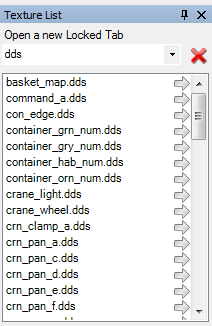
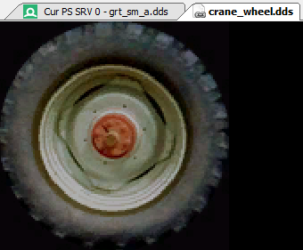

How do I view a specific texture?
=================================

This page documents how to open a specific texture by name, without needing to find it via a current resource binding.

Texture list in Texture Viewer
------------------------------

.. |page_white_stack| image:: ../imgs/icons/page_white_stack.png

In the texture viewer you can open a filterable list of all textures in the capture. This can be opened with the texture list icon |page_white_stack|. When clicked on this will open a sidebar on the texture viewer that lists all textures.

	Texture list: The sidebar showing the list of textures

This list of textures can be filtered by a custom string which will narrow the list of textures displayed, or simply by their creation flags as either a render target or a texture.

When selecting and opening one of the textures from here, a new tab is opened in the texture viewer that follows that texture.

Locked tab of a Texture
-----------------------

By default the tab open in the texture viewer follows whichever pipeline slot is currently selected. When a new event is selected this tab can display a new texture if the contents of that slot has changed.

If you want to follow a particular texture even as it becomes unbound or moves from output to input and vice versa, you can open a new locked tab that will stay consistently on this texture.

	Texture Tabs: Default tab following pipeline slot vs Locked tab.

This can be done by locating the texture by name as above, then clicking on the entry in the list. This will open up a new tab for this texture which will not change regardless of the current pipeline state, or current event.

Opening a texture from the pipeline state viewer (:doc:`how_object_details`) will also open a new locked tab for the texture in question. You can also open a new locked tab by right clicking on the texture thumbnail while it is currently bound.

.. figure:: ../imgs/Screenshots/OpenLockedTab.png

	Opening new Tab: Opening a new locked tab for a texture.

See Also
--------

* :doc:`../how/how_annotate_capture`
* :doc:`../window/texture_viewer`
