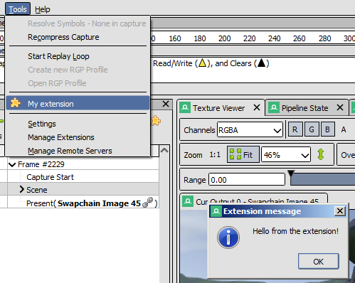
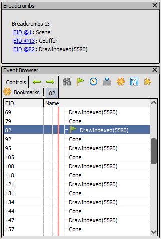

Writing UI extensions
=====================

This document outlines how to get started writing a UI extension. For information on how to configure, register and install a UI extension see :doc:`../how/how_python_extension`.

First steps
-----------

We start off with the basic registration function. Create an ``__init__.py`` in your extension's root and fill it out:

.. highlight:: python
.. code:: python

    import qrenderdoc as qrd

    extiface_version = ''

    def register(version: str, ctx: qrd.CaptureContext):
        global extiface_version
        extiface_version = version

        print("Registering my extension for RenderDoc version {}".format(version))

    def unregister():
        print("Unregistering my extension")

Here we create the minimum ``register()`` and ``unregister()`` functions required for an extension to load, that just print a message. We store the interface version in a global which we can use in future to do version-checks if we want to be compatible with more than one RenderDoc version, since the python interface is not fully forwards and backwards compatible.

This doesn't really do much, let's register a tool menu item:

.. highlight:: python
.. code:: python

    def menu_callback(ctx: qrd.CaptureContext, data):
        ctx.Extensions().MessageDialog("Hello from the extension!", "Extension message")

    def register(version: str, ctx: qrd.CaptureContext):
        # as above ...

        ctx.Extensions().RegisterWindowMenu(qrd.WindowMenu.Tools, ["My extension"], menu_callback)

Now we have a new menu item which when clicked produces a popup message dialog!

    Python extension generating a message box

This is a good proof of concept, but really we want something more directly usable. Instead of showing a message box, let's show a window which reacts to the selected action by showing a series of breadcrumbs for marker labels.

Adding a window and capture viewer
----------------------------------

First we create a class to handle our window and to derive from :py:class:`qrenderdoc.CaptureViewer` to get callbacks for events.

.. highlight:: python
.. code:: python

    class Window(qrd.CaptureViewer):
        def __init__(self, ctx: qrd.CaptureContext, version: str):
            super().__init__()

            self.mqt: qrd.MiniQtHelper = ctx.Extensions().GetMiniQtHelper()

            self.ctx = ctx
            self.version = version
            self.topWindow = self.mqt.CreateToplevelWidget("Breadcrumbs", lambda c, w, d: window_closed())

            ctx.AddCaptureViewer(self)

        def OnCaptureLoaded(self):
            pass

        def OnCaptureClosed(self):
            pass

        def OnSelectedEventChanged(self, event):
            pass

        def OnEventChanged(self, event):
            pass

Here we implement stubs for the different events. More information on when they are sent can be found in the class documentation. We use the :py:class:`qrenderdoc.MiniQtHelper` to create a top-level window for ourselves with the 'breadcrumbs' title, then register oureslves as a capture viewer. The mini-Qt helper is useful to provide simple access to Qt widgets in a portable way from the RenderDoc UI, without relying on full Qt python bindings that may not be available depending on how RenderDoc was built.

We will need to unregister ourselves as a capture viewer when the window is closed, which happens in the ``window_closed()`` callback that we'll define later.

An empty window is not very useful, so let's give ourselves a label. More complex layouts and widgets are of course possible but for the moment we'll keep it simple:

.. highlight:: python
.. code:: python

    vert = self.mqt.CreateVerticalContainer()
    self.mqt.AddWidget(self.topWindow, vert)

    self.breadcrumbs = self.mqt.CreateLabel()

    self.mqt.AddWidget(vert, self.breadcrumbs)

And finally we can fill in the event functions to set the breadcrumbs. We use ``@1234`` syntax for events which causes them to be clickable links that jump to that event. You can also convert a :py:class:`renderdoc.ResourceId` to a string with ``str()`` and it will similarly provide a link for that resource named with the current debug name.

.. highlight:: python
.. code:: python

    def OnCaptureLoaded(self):
        self.mqt.SetWidgetText(self.breadcrumbs, "Breadcrumbs:")

    def OnCaptureClosed(self):
        self.mqt.SetWidgetText(self.breadcrumbs, "Breadcrumbs:")

    def OnSelectedEventChanged(self, event):
        pass

    def OnEventChanged(self, event):
        action = self.ctx.GetAction(event)

        breadcrumbs = ''

        if action is not None:
            breadcrumbs = '@{}: {}'.format(action.eventId, action.name)

            while action.parent is not None:
                action = action.parent
                breadcrumbs = '@{}: {}'.format(action.eventId, action.name) + '\n' + breadcrumbs

        self.mqt.SetWidgetText(self.breadcrumbs, "Breadcrumbs:\n{}".format(breadcrumbs))

Finally we'll register a new menu item to display the window. We only allow one window at once, so if it still exists we'll just raise it. Otherwise we create a new one. This is also where we unregister the capture viewer:

.. highlight:: python
.. code:: python

    from typing import Optional

    cur_window: Optional[Window] = None

    def window_closed():
        global cur_window
        if cur_window is not None:
            cur_window.ctx.RemoveCaptureViewer(cur_window)
        cur_window = None

    def open_window_callback(ctx: qrd.CaptureContext, data):
        global cur_window

        mqt = ctx.Extensions().GetMiniQtHelper()

        if cur_window is None:
            cur_window = Window(ctx, extiface_version)
            if ctx.HasEventBrowser():
                ctx.AddDockWindow(cur_window.topWindow, qrd.DockReference.TopOf, ctx.GetEventBrowser().Widget(), 0.1)
            else:
                ctx.AddDockWindow(cur_window.topWindow, qrd.DockReference.MainToolArea, None)

        ctx.RaiseDockWindow(cur_window.topWindow)

    def register(version: str, ctx: qrd.CaptureContext):
        # as above ...

        ctx.Extensions().RegisterWindowMenu(qrd.WindowMenu.Window, ["Extension Window"], window_callback)

    def unregister():
        print("Unregistering my extension")

        global cur_window

        if cur_window is not None:
            # The window_closed() callback will unregister the capture viewer
            cur_window.ctx.Extensions().GetMiniQtHelper().CloseToplevelWidget(cur_window.topWindow)
            cur_window = None

With that we now have a new little breadcrumbs window that docks itself above our event browser to show where we are in the frame:

    Python extension showing the current action's breadcrumbs

Calling onto replay thread
--------------------------

So far this has worked well, but we're only using information available on the UI thread. A good amount of useful information is cached on the UI thread including the current pipeline state and actions, but for some work we might want to call into the underlying analysis functions. When we do this we must do it on the replay thread to avoid blocking the UI if the analysis work takes a long time.

This can get quite complex so we will do something very simple, in the message box callback that we created earlier instead of displaying the message box immediately we will first figure out the minimum and maximum values for the current depth output or first colour output and display that.

To start with we can identify the resource on the UI thread, so let's do that:

.. highlight:: python
.. code:: python

    import renderdoc as rd

    def menu_callback(ctx: qrd.CaptureContext, data):
        texid = rd.ResourceId.Null()
        depth = ctx.CurPipelineState().GetDepthTarget()

        # Prefer depth if possible
        if depth.resourceId != rd.ResourceId.Null():
            texid = depth.resourceId
        else:
            cols = ctx.CurPipelineState().GetOutputTargets()

            # See if we can get the first colour target instead
            if len(cols) > 1 and cols[0].resourceId != rd.ResourceId.Null():
                texid = cols[0].resourceId

        if texid == rd.ResourceId.Null():
            ctx.Extensions().MessageDialog("Couldn't find any bound target!", "Extension message")
            return

This all happens as before on the UI thread using UI-cached pipeline state data. If we can't find a resource we just bail out, but otherwise we have ``texid`` with the texture we want to analyse.

To do this we invoke onto a different thread twice - first the UI thread invokes onto the replay thread to calculate the minimum and maximum values. Then that callback invokes back onto the UI thread to display a message.

.. highlight:: python
.. code:: python

    if texid == rd.ResourceId.Null():
        ctx.Extensions().MessageDialog("Couldn't find any bound target!", "Extension message")
        return
    else:
        mqt = ctx.Extensions().GetMiniQtHelper()
        texname = ctx.GetResourceName(texid)

        def get_minmax(r: rd.ReplayController):
            minvals, maxvals = r.GetMinMax(texid, rd.Subresource(), rd.CompType.Typeless)

            msg = '{} has min {:.4} and max {:.4} in red'.format(texname, minvals.floatValue[0], maxvals.floatValue[0])

            mqt.InvokeOntoUIThread(lambda: ctx.Extensions().MessageDialog(msg, "Extension message"))

        ctx.Replay().AsyncInvoke('', get_minmax)

Now that we've done that correctly our extension will be able to run in-depth replay analysis without calling functions from the wrong thread or stalling the UI.

Conclusion
----------

Hopefully now from that worked example you have an idea of the basics of writing UI extensions. More complex examples can be found at the `community contributed repository <https://github.com/baldurk/renderdoc-contrib>`_ and the source code for this extension is available in the `github repository <https://github.com/baldurk/renderdoc/tree/v1.x/docs/python_api/ui_extension_tutorial>`_
