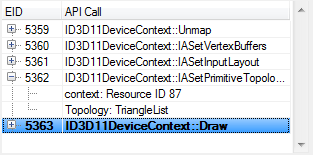

API Inspector
=============

Although not the most complex part of the RenderDoc's UI, this page details the features and functionality of the API Inspector.

UI Elements
-----------

The API Inspector is divided into two sections - the top section is the most common, detailing all of the API calls leading up to and including the current drawcall. The special case for this is the end of the frame where there may not be a final drawcall but the API Inspector lists the API calls that preceded the final flip of the backbuffer that marks the end of RenderDoc's captured frame.

The bottom section is less commonly used but shows the callstack from user code into the API entry point, if such a callstack is available and the symbols are resolved. For more information check out the page on :doc:`../how/how_capture_callstack`.

API Calls
---------

This section lists the series of API calls made between the preceding drawcall and the currently selected drawcall. The current drawcall is always the last element in this list and is highlighted in bold. By default it is also the selected element.

Each API call can be expanded to see the parameters that were passed to it, in the form that they were serialised out to the log file.

	API Calls: A list of API calls made up to the current draw.

Callstack
---------

The callstack section can be expanded by double clicking on the separator and collapsed in the same way. Once open its size can be adjusted by clicking and dragging on the separator.

This section will either show "No callstack available" or "Need to resolve symbols" as appropriate when the callstacks aren't ready for display.

The callstack follows the currently selected API call in the other section, and will update both as that selected call change and as the current event changes (as this implicitly changes the API call selected to whichever the current drawcall is).

For more information see :doc:`../how/how_capture_callstack`

.. figure:: ../imgs/Screenshots/CallstackPanel.png

	Callstack: The callstack in user code where this API call was made.
