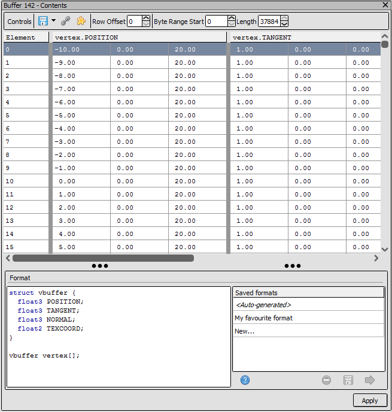
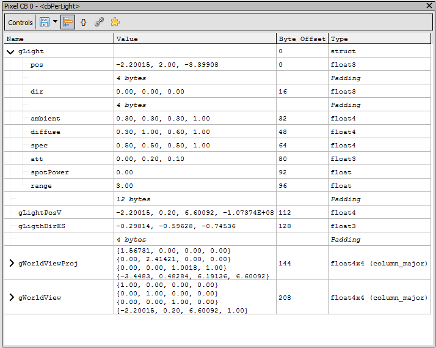

Buffer Viewer
=============

When opening a buffer for view, it can display both fixed non-repeating "struct-of-arrays" (SoA) data, repeated "array-of-structs" (AoS) data, or where supported by the API it can display both - with the fixed data coming as a prefix to repeated data.

.. note::

  "struct-of-arrays" (SoA) is used only in comparison to "array-of-structs" (AoS). The simple case of only fixed values with no arrays would also be considered SoA data, just with no arrays.

The format is defined initially by whatever reflection data is available. The format can be customised, as detailed in :doc:`../how/how_buffer_format`.

Constant buffers are assumed to be AoS data in all cases. Other views of buffers via non-constant bindings such as UAVs and storage buffers, or views opened directly from a buffer from the resource inspector, will default towards SoA data unless the layout explicitly declares a fixed set of SoA data.

    The buffer being viewed as an array of structs (AoS).

    The buffer being viewed as a struct of arrays (SoA).

Navigation
----------

The buffer viewer can specify the visible range to be interpreted, given a byte offset and length. Only bytes within this range will be displayed, with any other data from outside the range showing as ``---``.

The initial values of the offset and length will be taken from the relevant binding, or default to the entire buffer if no subset is referenced by the binding.

In addition to this, you can specify a row offset which is useful in remaining at the same row while watching the change in a buffer between different events.

Exporting and display
---------------------

.. |align| image:: ../imgs/icons/align.png

When displaying fixed SoA data as above, the padding can be visualised by enabling the |align| option.

Buffer data can be exported either as CSV values, or where the buffer is backed by byte memory as raw bytes.

See Also
--------

* :doc:`../how/how_buffer_format`
