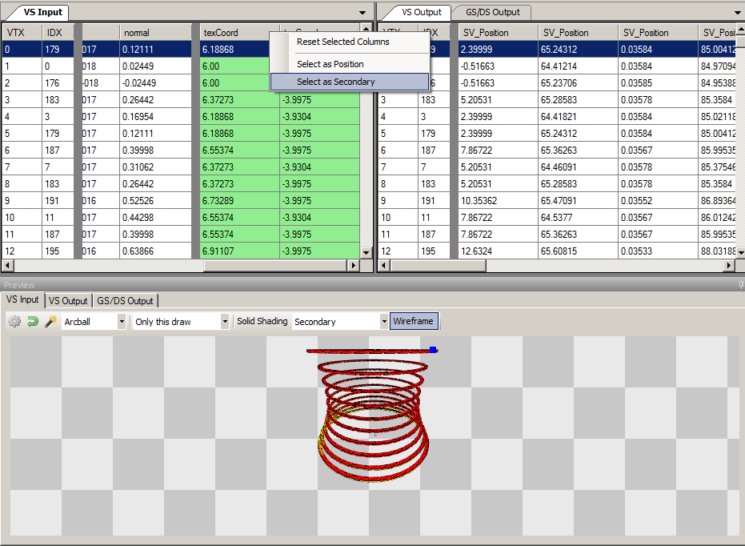

Buffer/Mesh Viewer
==================

The buffer viewer has two reasonably distinct modes - the first rather specialised to show meshes and the mesh data as it passes through the pipeline. The other shows a raw arbitrary buffer with a custom (and arbitrary) formatting.

Mesh Viewer
-----------

The Mesh Viewer shows both the mesh data as well as a visual representation of the mesh at different stages - pre VS, post VS, etc. For instanced drawcalls you can choose which instance to view in the toolbar at the top.

.. |arrow_join| image:: ../imgs/icons/arrow_join.png

Each vertex has a display that shows the mesh data, the format of which is pulled from the relevant stage of the pipeline - shader input or output, or vertex input attributes. You can choose to sync these views |arrow_join| as well as specify an offset which will stay consistent, so that you can see the same row as you move between different events.

Below this is a 3D view which will show one stage at any given time, and can be switched with the tabs above it. There are two control schemes for viewing the 3D mesh - Arcball which is the default for pre-transform (VS input), and WASD controls which is the default for post-transform (VS output). You can switch between these at any time with the dropdown on the toolbar above the mesh view.

.. note::

	When tessellation is active, VS out behaves similarly to VS in as they are both considered input data (rather than post-transform data).

.. |arrow_undo| image:: ../imgs/icons/arrow_undo.png

You can reset the camera to its default location with the reset button |arrow_undo|. For VS Input this resets to an arcball at some radius from the object. For VS Output this resets to a view from the projected eye.

.. |wand| image:: ../imgs/icons/wand.png

You can also auto-fit the camera to the mesh for the VS Input mesh. The auto-fit button |wand| will fit the camera to the axis-aligned bounding box of the mesh.

To be able to view the post-transform mesh in view-space, RenderDoc attempts to guess the projection matrix and unprojects the output data.

By default the projection matrix is guessed as a standard perspective matrix. Using the post-projection w and z values and the aspect ratio of the output targets a reasonable approximation can be estimated. The FOV must be specified though - the default is 90 but this can be refined by opening the options.

.. |cog| image:: ../imgs/icons/cog.png

Opening the options |cog| you can specify the FOV used in the projection matrix. If you used an orthographic matrix instead you can specify this - although this requires manual tuning of the matrix parameters.

.. figure:: ../imgs/Screenshots/BufferOptions.png

	Options: The options pop-out of the buffer viewer.

Also available in the options is a simple speed multiplier for the WASD controls, to fine-tune how fast it moves to the dimensions of the mesh.

Mesh Preview
------------

In the 3D Mesh preview, you have the option to display the mesh with some solid shading modes, not just as a wireframe mesh. When solid shading you can toggle the wireframe on and off.

* Solid Color simply displays a solid color for each triangle.
* Flat Shaded will perform basic flat lighting calculations based on triangle normals to give a better idea of the topology of the mesh.
* Secondary will display the selected secondary mesh element.

To select which element will be displayed as secondary, simply right click on the column you would like to use. This can be done on the input and output separately, and 4-component columns have the option to either show RGB as color, or alpha as grayscale.

The selection will be remembered as long as the mesh format stays consistent between draws.

You can also use this if the position data isn't detected in your inputs and you'd like to choose which element contains the positions, or if you'd like to visualise some other data such as UV co-ordinates as positional (in effect rendering the mesh in uv-space).

	Preview: Previewing the uv co-ordinates as color on the mesh.

When displaying the post-projection output - typically the VS output, but possibly tessellation/geometry output - you can select how much data to display.

The dropdown above the mesh view will let you choose to show :guilabel:`this draw`, :guilabel:`previous instances` as well, :guilabel:`all instances` in the drawcall, or the :guilabel:`whole pass` up to this point.

These let you narrow or expand the mesh outputs displayed. At minimum you will see the current draw - a specific instance, if the drawcall is an instanced draw. You can also display other instances in the same drawcall (either up to the selected instance, or all instances before or after the selected instance). Finally you can opt to display all other meshes up to the current draw in the same notional render pass.

The current draw is always dark tinted, instances within the same draw have a lighter red color, and other drawcalls in the pass will be light gray.

Raw Buffer Viewer
-----------------

When opening a buffer as a raw display, sometimes a default layout will be specified e.g. if available from shader reflection data. If not, the layout will default to 4 32bit unsigned integers.

This format can be refined and customised by entering a structure-like definition into the text box at the bottom of the window. The given types are listed below, and can be combined in hlsl- or glsl-like fashion specifying n-wide vector elements.

In addition to this, you can specify a row offset which is useful in remaining at the same row while watching the change in a buffer between different events, as well as a byte offset to shift the data along from the start of the buffer (e.g. if what you are interested in starts only part-way through the buffer but is not aligned along the data stride you enter).

.. figure:: ../imgs/Screenshots/RawBuffer.png

	Buffer specification: Specifying a custom buffer format.

Below are listed the basic types. You can append a number to each of these to make an N-wide vector (e.g. ``ushort4`` or ``float3``, or ``uvec4``/``vec3``). You can also specify matrices as ``float3x4`` or ``mat3x4``. By default matrices are column major, but you can change this by prepending ``row_major`` as you would in hlsl.

* ``uint`` - unsigned 32bit integer
* ``bool`` - unsigned 32bit integer (this is the format for hlsl bools)
* ``int`` - signed 32bit integer
* ``ushort`` - unsigned 16bit integer
* ``short`` - signed 16bit integer
* ``ubyte`` - unsigned 8bit integer
* ``byte`` - signed 8bit integer
* ``double`` - 64bit floating point
* ``float`` - 32bit floating point
* ``half`` - 16bit floating point

There are also some non-hlsl types for displaying other formats which don't have a corresponding native hlsl type

* ``unormb`` - 8bit unsigned normalised value
* ``unormh`` - 16bit unsigned normalised value
* ``unormf`` - 32bit unsigned normalised value
* ``snormb`` - 8bit signed normalised value
* ``snormh`` - 16bit signed normalised value
* ``snormf`` - 32bit signed normalised value
* ``uintten`` - 4 component unsigned integer format, packed as 10:10:10:2
* ``unormten`` - 4 component unsigned normalised format, packed as 10:10:10:2
* ``floateleven`` - 3 component floating point format, packed as 11:11:10
* ``xuint`` - hex-formatted 32bit integer
* ``xshort`` - hex-formatted 16bit integer
* ``xbyte`` - hex-formatted 8bit integer
