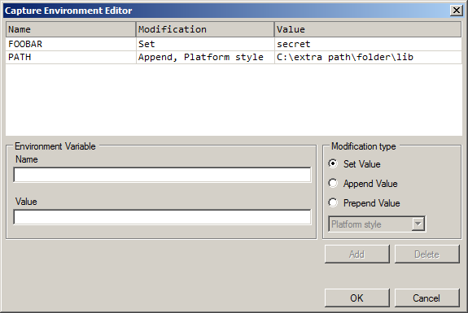
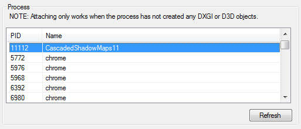

Capture Dialog
==============

The Capture Dialog (which doubles as the inject-into-process dialog) is the single point where programs are launched and captures are saved to disk.

After launching a capture a connection dialog will open to allow you to manage and open any captures you take. See :doc:`capture_connection` for more details.

.. note::

  NOTE: The Load Settings and Save Settings buttons on this dialog refer to loading and saving the set of settings and options configured on this dialog. They do *not* refer to loading and saving the capture files produced from capturing - that is done from the :guilabel:`File` menu.

Capturing
---------

To capture a program you need to provide the details of the application to be launched, at minimum locating the executable to run.

The Program section of the dialog prompts for the executable to be launched, the working directory, any command-line arguments to be passed to the program. It also lets you specify any modifications you want to make to the environment variables.

.. figure:: ../imgs/Screenshots/CapturePathCmdline.png

  Program Capture: Configuring and launching an exe directly from RenderDoc.

The :guilabel:`...` buttons next to the executable path and working directory can be used to browse through the file system. If you are working in :doc:`a remote context <../how/how_network_capture_replay>` then the file and directory browser will be replaced by one that browses in the file system of the remote context. By default if the working directory box is left empty then the directory containing the executable will be used as the working directory.

The :guilabel:`...` button next to the environment variables line will open up an editing that allows you to specify any changes to the environment variables that you'd like to make when launching the program. This could be used for example to set a configuration option, or perform necessary setup for correct running like configuring a path or setting the ``DISPLAY`` variable.

  Environment Variables: changing the environment that the executable will run under.

In the environment variable editor you can choose the name of the variable to change, and the value to use. Then you can choose the function to use.

* :guilabel:`Set` will overwrite any existing value or create the variable with the value you specify.
* :guilabel:`Prepend Value` and :guilabel:`Append Value` will add the value you specify to the start or beginning of the existing variable. If the variable does not already exist it will be created with the value.

  When prepending or appending you can also choose the separator to apply, for example if you are modifying the ``PATH`` variable. You can choose either colons ( ``:``), semi-colons ( ``;``), platform style ( ``;`` on Windows and ``:`` on other platforms), or no separator at all. If the variable does not exist, the separator won't be added, but if the variable does exist the separator will be added in between the existing value and the value you chose to add.

When you are ready to capture simply click the :guilabel:`Capture` button in the bottom right.

If you wish to save these particular settings you can click :guilabel:`Save Settings` to save them to a ``.cap`` file. This ``.cap`` file can either be loaded in manually, accessed through the :guilabel:`File` → :guilabel:`Recent Captures` menu. The ``.cap`` file can be associated with RenderDoc, and if so launching RenderDoc from this file will automatically load the capture settings. If :guilabel:`Auto start` is checked then double clicking on the ``.cap`` file will immediately trigger a capture with the given settings.

The last settings used to launch an executable will be automatically saved, and the next time you set up there will be a :guilabel:`Load Last Settings - Executable` button next to :guilabel:`Save Settings` and :guilabel:`Load Settings`. This can be useful if you didn't save your configuration but want to quickly re-launch it.

.. note::
  The process will be launched with the same permissions and by the same user as RenderDoc was launched. If your process requires specific permissions (such as administrator permissions) you will need to launch RenderDoc with these permissions.

Inject into Process
-------------------

.. caution::
  The process **must not** have invoked or initialised the API to be used, as this will be too late for RenderDoc to hook and capture it. At best RenderDoc will not capture, at worst it may cause crashes or undefined behaviour. Only inject to processes you can guarantee are early enough in their initialisation that they have not used the graphics API.

When invoked through :guilabel:`File` → :guilabel:`Inject into Process` the capture dialog modifies itself to give a list of processes running on the target system.

A list of processes is fetched once when the dialog is opened, but this can be refreshed by clicking on the :guilabel:`Refresh` button below the list. Select the process you would like to inject into and click :guilabel:`Inject`.

  Injecting: Injecting into an already-running process via RenderDoc.

.. _capture-options:

Capture Options
---------------

  | :guilabel:`Allow Fullscreen` Default: ``Enabled``

Allow Fullscreen simply means that RenderDoc will not interfere with any attempt by the application to switch into an exclusive fullscreen video mode. While debugging sometimes this can be awkward as you may wish to quickly switch to your debugger or another program.

If this option is unchecked, RenderDoc will attempt to modify any such attempt to an equivalent windowed mode.

----------

  | :guilabel:`Allow VSync` Default: ``Enabled``

Allow VSync functions very similarly to Allow Fullscreen. When disabled, RenderDoc will prevent any attempt to VSync by the application. This can be useful given that there is a certain degree of inevitable overhead from running with RenderDoc and VSync can amplify that.

----------

  | :guilabel:`Seconds Delay` Default: ``0 Seconds (Disabled)``

This option causes RenderDoc to stall for a defined number of seconds immediately after launching the process. Most commonly this is used so that you can launch a program in RenderDoc and immediately attach a traditional debugger before any significant code is executed.

This can be useful e.g. when early initialisation needs to be debugged.

----------

  | :guilabel:`Collect Callstacks` Default: ``Disabled``

This option will cause RenderDoc to save a callstack from user code into the API at every API call during the frame being captured. This can then be resolved later and used to determine where the application is calling each API call. More details can be found in :doc:`../how/how_capture_callstack`.

----------

  | :guilabel:`Only Drawcall Callstacks` Default: ``Disabled``

This option modifies the above capturing of callstacks to only be saved for drawcall-type API calls. This can reduce the CPU load, as well as file-size and memory overhead of capturing callstacks for every API call which may not be desired. Only valid if ``Collect Callstacks`` is enabled.

----------

  | :guilabel:`Enable API validation` Default: ``Disabled``

Enable API validation causes RenderDoc to enable the API's built-in debugging, and where possible serialise this out and include it in the capture for later inspection in the :doc:`debug_messages` window.

* On D3D11 & D3D12 this will activate the D3D debug layer and save out any messages.
* For OpenGL this means ``ARB_debug_output`` is automatically enabled.
* For Vulkan the ``VK_LAYER_LUNARG_standard_validation`` meta-layer is enabled and ``VK_EXT_debug_report`` is used to fetch any warnings or errors. The overhead from enabling this option is largely the same as the overhead of enabling the debug device without RenderDoc involved.

----------

  | :guilabel:`Capture Child Processes` Default: ``Disabled``

This option causes RenderDoc to hook into process creation calls from the target application. When this option is enabled those child processes will be injected with RenderDoc in the same way as the parent - which can be useful if you must launch your program through a launcher or level of indirection and still wish to use RenderDoc with one of the child processes.

:ref:`See below <child-process-hook>` for more information on handling of child processes.

.. note::
  Due to the hook implementation on linux, child processes will always be hooked regardless of whether this option is enabled or disabled.

----------

  | :guilabel:`Ref All Resources` Default: ``Disabled``

One method RenderDoc uses to keep capture file sizes down is to only include the referenced dependencies of a frame within a capture. This means that even if 100 textures are allocated and present, if 50 of them are never bound to the pipeline or otherwise referenced then they will not be included in the capture file. Enabling this option will cause RenderDoc to include all live resources at the time of capture regardless of whether they are used or not.

----------

  | :guilabel:`Capture All Cmd Lists` Default: ``Disabled``

.. note::
  This option applies to D3D11 only. It may also have a significant performance hit.

By default RenderDoc only begins capturing when you hit the capture key - any commands issued before this point are not available and so if a deferred command list was created before you hit capture and replayed after, it would not be available and RenderDoc would have to fall back and capture again in the hopes that next frame everything will be available.

If the application creates a command list early and replays it indefinitely without recreating it, RenderDoc will essentially have missed its chance to capture it by the time you hit the capture key. Enabling this option will cause RenderDoc to pre-emptively capture all command lists just in case they are used.

----------

  | :guilabel:`Verify Buffer Access` Default: ``Disabled``

This option adds checking to any ``Map()`` calls that adds a boundary marker after any ``Map()`` pointer returned during a captured frame. These markers are checked on ``Unmap()`` and if they have been modified a message box will pop up alerting you to this, and you can click Yes to break in the debugger in the target application and investigate the problem.

It will also initialise any buffers with undefined contents after creation with a marker value to catch use of undefined contents that may not always be zero.

.. note::
   This option is only supported on D3D11 and OpenGL currently, since Vulkan and D3D12 are lower overhead and do not have the infrastructure to intercept map writes.

----------

  | :guilabel:`Auto start` Default: ``Disabled``

This option is slightly different from the others in that it doesn't change anything for an immediate capture. When a ``.cap`` settings file is saved with the details of a particular capture, if this option is enabled then loading a ``.cap`` file from the command line (i.e. most commonly from a file association) will trigger a capture as soon as RenderDoc loads. This is useful for saving a common capture setting and running it with just one click.

----------

  | :guilabel:`Queue Capture of Frame` Default: ``Disabled``

This option allows you to queue up a precise capture of a given frame number after the program has started.

.. _child-process-hook:

Child Processes
---------------

RenderDoc is able to automatically inject into any child processes started by the initial process launched from the UI. To do this simply check :guilabel:`Capture Child Processes` in the options above.

RenderDoc has a particular handling of child processes to help you navigate to the process of interest. Whenever a child process is launched, the UI is notified and a list of processes is displayed in a box on the :doc:`capture_connection` window. You can double click on any of these entries to open up a new connection to that process, in a new window.

If a process exits, instead of just closing the connection window if there have been no captures, instead RenderDoc looks at the child processes - if there is only one child process, it assume that process must be of interest and immediately switches to tracking that process. If there are *more* than one child process open, the capture connection window will stay open to give you a chance to double click on those child processes to open a new connection window.

.. _global-process-hook:

Global Process Hook
-------------------

.. danger::

  This option is risky and should not be used lightly. Know what you're doing and use it as a last resort.

  It is only supported on Windows currently.

To expose this option you have to enable it in :doc:`the settings <settings_window>`, to prevent it being used accidentally.

When you've entered a path, or filename, in the executable text at the top of the window, this option will then insert a global hook that causes **every** new process created to load a very small shim dll.

The shim dll will load, create a thread that checks to see if the process matches the path or filename specified, and then unload. If the process matches it will also inject RenderDoc and capturing will continue as normal. At this point you should *first disable the global hook*, then you can use the 'Attach to running instance' menu option to continue as normal.

RenderDoc implements this behaviour by modifying the `AppInit_DLLs <http://support2.microsoft.com/kb/197571>`_ registry key to reference RenderDoc's dlls. This is not a particularly safe method but it's the only reliable method to do what we want. The shim dll is deliberately made as small and thin as possible, referencing only ``kernel32.dll``, to minimise any risks.

.. note::

  If you have 'secure boot' enabled in Windows, the AppInit_DLLs registry key will not work. To use the global process hook you must disable secure boot.

If RenderDoc crashes or something otherwise goes wrong while these registry keys are modified, the shim dll will continue to be injected into every process which is certainly not desirable. Should anything go wrong, RenderDoc writes a ``.reg`` file that restores the registry to its previous state in ``%TEMP%``.

Again, **this method should be a last resort**. Given the risks you should always try to capture directly in some way before trying this.

See Also
--------

* :doc:`../getting_started/quick_start`
* :doc:`../how/how_capture_callstack`
* :doc:`../how/how_capture_frame`
* :doc:`../how/how_network_capture_replay`
