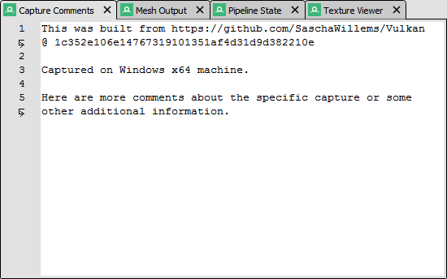

Capture Comments
================

	Capture Comments: Adding free-form text notes to be saved with a capture

The capture comments panel allows for adding arbitrary comments to a capture. This is mostly used for :doc:`annotating a capture <../how/how_annotate_capture>` since the comments written here will be available to anyone loading the capture. It's also a useful to permanently store the build or machine configuration where the capture was created.
