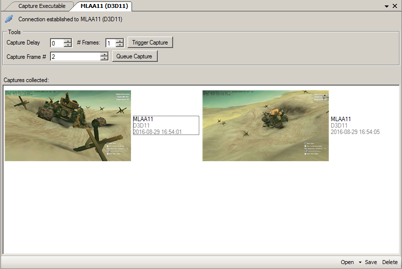

Capture Connection
==================

The capture connection window opens up when you launch a capture of a program, as well as when you attach to an existing program.

Attaching to an existing instance
---------------------------------

After you've launched a program through RenderDoc and its hooks are added you can freely disconnect (by closing the capture connection window) or close the main UI. You can then connect to this again later, either from the same computer or another computer connecting over the network. For more information, see the page about :doc:`network capture and replay <../how/how_network_capture_replay>`.

To connect to an existing hooked program, select :guilabel:`File` → :guilabel:`Attach to Running Instance`. This opens up the remote host management window that allows you to select a remote host to connect to. localhost is always in the list, but you can add and remove other hosts.

.. warning::

	Please note that none of the connections RenderDoc makes or uses are encrypted or authenticated/protected, so if this is a concern you should look into securing the connections manually.

	Remote Hosts: Attaching to a running instance either locally or remotely.

When the window opens, when you add a new host, or when you click refresh then the hosts will be queried across the network to see if a connection exists. While this is in progress the host will be listed in italics and with a busy icon.

Once a host has been scanned, if any instances are found then that host can be expanded to see the list, and details are listed about each instance. The name is OS-dependent but is usually the executable name. The API name is listed, as well as the username of any user that is already connected.

When you click connect, a capture connection window will be opened up - just the same as the window that is automatically opened when you start a program. Any captures that have already been made before you connect will then populate.

.. note::

	If you connect to a running instance, any existing user will be disconnected. Just seeing the instances running on a host will not.

For more information about specifically a network capture-and-replay workflow, please see :doc:`../how/how_network_capture_replay`.

Capture Connection window
-------------------------

When a capture is launched (or attached to) the connection window is opened in the main UI. If you end up only taking one capture and closing the program afterwards the connection window will automatically close and open that capture. Similarly if you don't take any captures at all the window will close when the program exits. These cases don't need the management options the connection window provides.

While a program is running, a couple of tools are available for triggering specific captures, which can be used as well as the keystroke capture triggers in the application.

	Connection Window: Tools for triggering specific frame captures.

Firstly you can trigger a capture, with an optional delay in seconds, and for an arbitrary number of frames. When you click :guilabel:`Trigger Capture` the delay will count down, and then the application will capture the selected number of sequential frames into separate captures. By default the delay is 0 seconds and only one frame is captured.

Next you can queue a capture at a specific frame number, if you know that a bug will happen at a given point.

.. note::

   Capturing a frame in RenderDoc will cause a noticeable stall on any non-trivial application, so if you are investigating a timing issue often this can throw things off and hide the bug. However capturing multiple frames can be useful when you know a bug alternates every N frames, or you specifically want to debug how N sequential frames look and you know extreme frame times won't skew the results.

During running or after the application has closed, all captures will appear as thumbnails here. As mentioned above, if only one capture is made and the application is closed the capture dialog will automatically begin to load it up in the UI. Otherwise you can use this window to browse the captures, save and delete any frame captures, and open them either in the currently running UI or in a new separate instance.

	Connection Window: Viewing multiple captures taken in a program.

In this example we have a connection window open to the debugmarker sample from Sascha Willms' Vulkan examples. Three captures have been made and we can see their thumbnails to help distinguish between them. This is visible at any point, regardless of whether you have close the program or not - you can simply switch back to RenderDoc while it's running.

.. note::

	Note, if you have remotely connected you will need to wait while the captures copy across the network to your PC, after which point everything behaves the same as a local capture.

From here you can save these captures out - as currently they are only temporary copies that will be cleaned up on close. You can also manually delete any capture you wish to discard.

Double clicking on any capture will close any current open capture in the RenderDoc UI, and open up that capture for inspection. You may also right click or use the drop-down menu on the open button to launch a new instance of RenderDoc for viewing the log. This is mostly useful if you want to compare two captures side-by-side easily.

You can press F2 or single click on a selected capture (not double click) to rename the default label given to each capture. This can be useful if you're changing something as you go or toggling an option and you want to remember which capture is which.

.. figure:: ../imgs/Screenshots/OpenCapNewInstance.png

	New instance: Launch new RenderDoc instance to open this capture.

Child Processes
---------------

RenderDoc is able to automatically inject into any child processes started by the initial process launched from the UI. To do this simply check :guilabel:`Capture Child Processes` when :doc:`capture_attach`.

RenderDoc has a particular handling of child processes to help you navigate to the process of interest. Whenever a child process is launched, the UI is notified and a list of processes is displayed in a box on the capture connection window. You can double click on any of these entries to open up a new connection to that process, in a new window.

If a process exits, instead of just closing the connection window if there have been no captures, instead RenderDoc looks at the child processes - if there is only one child process, it assume that process must be of interest and immediately switches to tracking that process. If there are *more* than one child process open, the capture connection window will stay open to give you a chance to double click on those child processes to open a new connection window.

See Also
--------

* :doc:`../how/how_network_capture_replay`
* :doc:`capture_attach`
