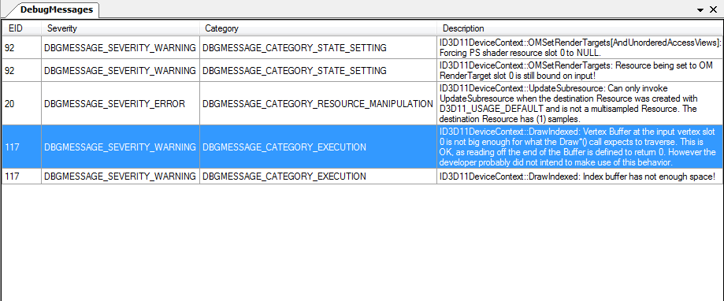

Debug Messages
==============

The Debug Messages window shows messages from the API including warnings about performance issues or concerns about potential hazards, as well as errors on invalid use of the API.

RenderDoc will alert you if there are any debug messages to show from the log by flashing in the status bar. Sometimes RenderDoc will also add new alerts there that aren't part of the original log if there are warnings or problems that it encounters while processing and analysing the log.

Capturing with debug messages included
--------------------------------------

To include these debug messages in a log, check on the :guilabel:`Enable API validation` option in the capture options. For more information see :doc:`capture_attach`

Debug Messages
--------------

This window is fairly simple. Each message retrieved from the api will be listed on its own row showing the event ID that triggered the message, along with a severity and category.

Double clicking on any row will take you to the corresponding event ID in the event browser.

	Debug Messages: The Debug Messages window showing some API messages.
