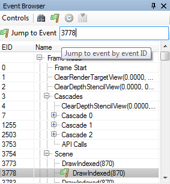

Event Browser
=============

The Event Browser is the primary method of browsing the frame and selecting different drawcalls. It displays the user-annotated hierarchical display of sections.

Annotating your frame
---------------------

The Event Browser becomes most useful when the application has user-defined annotations of sections and subsections of the frames, to allow for a more logical and ordered browsing of the frame.

Doing this is API and platform specific. Example code for D3D11 is included below, using the ``D3DPERF`` library that is exported by ``d3d9.dll``, which can still be used in D3D11. (The newer ``ID3DUserDefinedAnnotation`` API is also supported).

.. highlight:: c++
.. code:: c++

	D3DPERF_BeginEvent(0xffffffff, L"Start of example");

	D3DPERF_BeginEvent(0xff00ff00, L"Sub section");
	// events inside the subsection
	D3DPERF_EndEvent();

	// events outside the subsection
	D3DPERF_EndEvent();

This will generate a section of the frame with a subsection that includes some events, and then some further events that are siblings of the subsection.

OpenGL can make use of the ``KHR_debug`` extension, and Vulkan can use the ``VK_EXT_debug_marker`` extension.

Selecting available columns
---------------------------

By default, the columns in the event browser are EID and Name. Name cannot be removed as it contains the tree, but otherwise the columns can be customised both to hide/display or reorder and resize.

.. |timeline_marker| image:: ../imgs/icons/timeline_marker.png

To select which columns should be visible, right click the header or click the |timeline_marker| select columns button.

To rearrange the columns simply click and drag on the header.

.. note::

	Note that when timing drawcalls the duration column will automatically be added to display the data.

Timing drawcalls
----------------

.. |time| image:: ../imgs/icons/time.png

To time the GPU duration of each drawcall, click the timer button |time|.

This will automatically run a process to get the time of each drawcall and display it in the duration column, which will be added if necessary.

You can configure which time unit is used for the duration column on the fly in the :doc:`options_window`.

Browsing the frame
------------------

The event browser is primarily intended as a tool to browse through the frame. Events are listed as entries in the browser and the hierarchical labels mentioned above become tree nodes.

.. |flag_green| image:: ../imgs/icons/flag_green.png

The currently selected event is highlighted and indicated with a green flag |flag_green|. This is the event that RenderDoc is inspecting and is reflected in all the other windows of the UI.

.. figure:: ../imgs/QuickStart/QuickStart4.png

	Current Event: The Event browser showing several sections and the current event.

The EID column indicates the event ID of the drawcall listed. Event IDs are assigned starting from 1 and increase every time an API call is made - for this reason drawcall EIDs are not necessarily contiguous.

Simply clicking on a different event will select it as current, and selecting a parent node with some child events will act as if the final child is selected - in other words selecting a node with several children will show the results of all children having happened.

You can also use keyboard shortcuts to browse through the frame. Pressing up or down arrow key will move up and down through the visible elements, skipping over any sections which are collapsed. These keys will move into and out of a sub-section into the next sibling afterwards - essentially going straight up and down as if there is not a tree and it is a straight list.

The left and right arrows go into and out of hierarchy levels. When within a level pressing left will jump to the parent node of the current level. Pressing left again will collapse that node, and so on. Pressing right will (if on a node with children) expand that node.

.. note::

	This window supports copy and paste, so simply select the entries and ctrl-c to copy to the clipboard

Bookmarks
---------

.. |asterisk_orange| image:: ../imgs/icons/asterisk_orange.png

The |asterisk_orange| bookmark button will allow you to bookmark an event, the shortcut key is :kbd:`CTRL-B`.

.. figure:: ../imgs/Screenshots/BookmarksBar.png

	Bookmarks bar: The bookmarks bar with several EIDs bookmarks.

A list of bookmarked events will show up on a toolbar at the top of the event browser, they and the shortcut keys :kbd:`CTRL-1` to :kbd:`CTRL-0` will jump to the respective bookmarked EID. These shortcuts will work anywhere in the application.

Searching and Jumping
---------------------

There are two other controls available in the Event Browser to aid in navigating the frame.

.. |find| image:: ../imgs/icons/find.png

Pressing :kbd:`Ctrl-F` will open the find-event toolbar |find|. This toolbar allows you to type in a partial text filter that will be matched against both labels and drawcall events. The find will be executed when you press enter, although you can then adjust the text and re-search if you wish.

If the event found lies inside an unexpanded section, the sections will be expanded until the matching event is visible.

Matching events will be highlighted with a find icon |find|, and pressing enter repeatedly will jump between matching events.

.. |cross| image:: ../imgs/icons/cross.png

The find toolbar isn't dismissed until you press escape in the text box, or click the close button |cross|.

.. |stepprev| image:: ../imgs/icons/stepprev.png
.. |stepnext| image:: ../imgs/icons/stepnext.png

You can also jump up and down between find results with the previous |stepprev| and next |stepnext| buttons.

.. figure:: ../imgs/Screenshots/FindResults.png

	Highlighted Results: The results of a find are highlighted with an icon.

Pressing :kbd:`Ctrl-G` will open the jump to EID toolbar. This allows you to type in an EID and jump straight there, expanding nodes as necessary. If the EID typed doesn't exist in the list of drawcalls, the closest matching EID will be jumped to.

When you hit enter to jump to an EID, the toolbar closes and if you wish to jump again you must press :kbd:`Ctrl-G` again

	Jumping around: The jump-to-EID toolbar prompting for an event.
