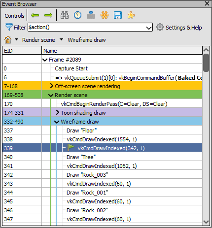
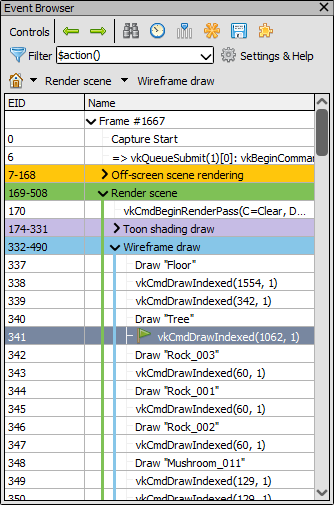

Event Browser
=============

The Event Browser is the primary method of browsing the frame and selecting different actions. It displays the user-annotated hierarchical display of sections.

Annotating your frame
---------------------

The Event Browser becomes most useful when the application has user-defined annotations of sections and subsections of the frames, to allow for a more logical and ordered browsing of the frame.

Doing this is API and platform specific. More information on how to do it can be found in :doc:`../how/how_annotate_capture`.

The colours of any marker regions provided by these API functions will be used to markup the row for the region as well as showing a bar along the left side of the tree showing which regions an event is in.

Filtering displayed events
--------------------------

By default the Event Browser only lists actions. Actions are events like draws, dispatches, copies, clears, resolves, and other calls that cause the GPU to do work or can affect memory and resources like textures and buffers. This is sometimes referred to as a drawcall, but the term action is used to be less ambiguous compared to actual rasterization drawing.

Often these are the only events you need to see to browse the frame, but there are cases where you may want to see some state setting calls to see where state is changed. To do this you can change the filter on the event browser from the default to include them.

Filter expressions can be quite complex and are explained in :doc:`../how/how_filter_events`.

The filter expression has a drop-down which allows you to select any of the pre-saved filters, and you can save new filters in the settings window.

Event display
-------------

Events displayed in the Event Browser are typically derived from the parameters to the API call itself. A small number of events will have custom generated names - these are typically for example indirect draws where it is more useful to see the used GPU draw parameters instead of the raw CPU side buffer, or for renderpasses where the load and store ops can be displayed.

There are controls to tweak these names available under the :guilabel:`Settings & Help` window when configuring the filter.

To show these options by way of example, take this default display of a section of a captured frame:

	Default Display: The Event browser with the default event naming.

| :guilabel:`Show custom action names` Default: ``Enabled``

This option controls whether the custom names are used as detailed above for e.g. indirect draws and renderpasses. Note the effect that disabling it has on the renderpass beginning and command buffer boundary.

.. figure:: ../imgs/Screenshots/EventsNoCustom.png

	Disabled Custom Action Names: The Event browser with custom names disabled.

| :guilabel:`Show parameter names and values` Default: ``Disabled``

This option controls whether the names of parameters are included as well as their values. By default no parameter names are given and only the values are visible.

.. note::
	This will have no effect on actions with custom names, as controlled above in :guilabel:`Show custom action names`.

	Parameter names: The Event browser with parameter names displayed as well as parameter values.

| :guilabel:`Show all parameters` Default: ``Disabled``

This option controls whether all parameters are displayed, or whether only the most significant ones are included. Note that with all parameters displayed it can be hard to make anything out as some functions have uninteresting implicit parameters like the command buffer.

.. note::
	This does not affect parameter values, which in the case of structures will still only show an elided struct in many cases. Also as above with :guilabel:`Show parameter names and values` this will have no effect on actions with custom names, as controlled above in :guilabel:`Show custom action names`.

	All Parameters: A snippet of the Event browser showing all function parameters.

Selecting available columns
---------------------------

By default, the columns in the event browser are EID and Name. Name cannot be removed as it contains the tree, but otherwise the columns can be customised both to hide/display or reorder and resize.

.. |timeline_marker| image:: ../imgs/icons/timeline_marker.png

To select which columns should be visible, right click the header or click the |timeline_marker| select columns button. To rearrange the columns simply click and drag on the header.

.. note::

	Note that when timing actions the duration column will automatically be added to display the data.

Timing actions
--------------

.. |time| image:: ../imgs/icons/time.png

To time the GPU duration of each action, click the timer button |time|.

This will automatically run a process to get the time of each action and display it in the duration column, which will be added if necessary.

You can configure which time unit is used for the duration column on the fly in the :doc:`settings_window`.

To examine more GPU counters than just plain duration, see :doc:`performance_counter_viewer`.

Browsing the frame
------------------

The event browser is the primary way to browse through the frame. Events are listed as entries in the browser and the hierarchical labels mentioned above become tree nodes.

.. |flag_green| image:: ../imgs/icons/flag_green.png

The currently selected event is highlighted and indicated with a green flag |flag_green|. This is the event that RenderDoc is inspecting and is reflected in all the other windows of the UI.

	Current Event: The Event browser showing several sections and the current event.

The EID (Event ID) column indicates the ID of the event. Event IDs are assigned starting from 1 and increase every time an API call is made. For this reason action EIDs are usually not contiguous because there are state setting events in between which also have EIDs.

Simply clicking on a different event will select it as current, and selecting an entry with some child events will act as if the final child is selected - in other words selecting a node with several children will show the results of all children having happened.

You can also use keyboard shortcuts to browse through the frame. Pressing up or down arrow key will move up and down through the visible elements, skipping over any sections which are collapsed. These keys will move into and out of a sub-section into the next sibling afterwards - essentially going straight up and down as if there is not a tree and it is a straight list.

The left and right arrows go into and out of hierarchy levels. When within a level pressing left will jump to the parent node of the current level. Pressing left again will collapse that node, and so on. Pressing right will (if on a node with children) expand that node.

.. note::

	This window supports copy and paste, so simply select the entries and ctrl-c to copy to the clipboard

Bookmarks
---------

.. |asterisk_orange| image:: ../imgs/icons/asterisk_orange.png

The |asterisk_orange| bookmark button will allow you to bookmark an event, the shortcut key is :kbd:`Ctrl-B`.

.. figure:: ../imgs/Screenshots/BookmarksBar.png

	Bookmarks bar: The bookmarks bar with several EIDs bookmarks.

A list of bookmarked events will show up on a toolbar at the top of the event browser, they and the shortcut keys :kbd:`Ctrl-1` to :kbd:`Ctrl-0` will jump to the respective bookmarked EID. These shortcuts will work anywhere in the application.

For more information see :doc:`../how/how_annotate_capture`.

Searching and Jumping
---------------------

There are two other controls available in the Event Browser to aid in navigating the frame.

.. |find| image:: ../imgs/icons/find.png

Pressing :kbd:`Ctrl-F` will open the find-event toolbar |find|. This toolbar allows you to type in a partial text filter that will be matched against both labels and action events. The find will be executed when you press enter, although you can then adjust the text and re-search if you wish.

.. tip::

	If you want to go to a particular event you can search for its EID. The find results will only show the matching event, and not any other events which might match that number by substring.

If the event found lies inside an unexpanded section, the sections will be expanded until the matching event is visible.

Matching events will be highlighted with a find icon |find|, and pressing enter repeatedly will jump between matching events.

The find toolbar isn't dismissed until you press escape in the text box, or click on the find-event tool button |find| again.

.. |arrow_left| image:: ../imgs/icons/arrow_left.png
.. |arrow_right| image:: ../imgs/icons/arrow_right.png

You can also jump up and down between find results with the previous |arrow_left| and next |arrow_right| buttons.

.. figure:: ../imgs/Screenshots/FindResults.png

	Highlighted Results: The results of a find are highlighted with an icon.

See Also
--------

* :doc:`../how/how_annotate_capture`
