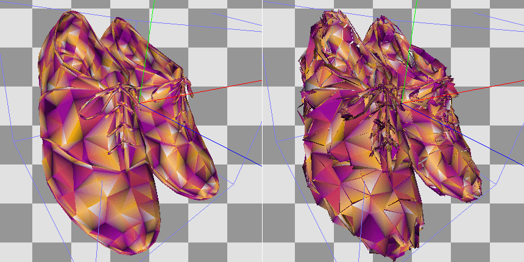
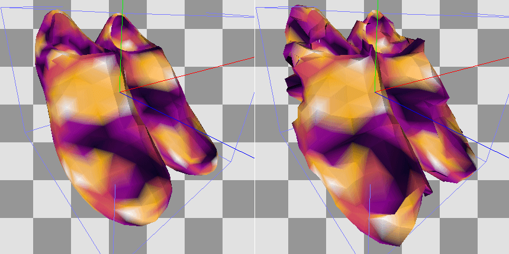

Mesh Viewer
===========

The Mesh Viewer shows both the mesh data as well as a visual representation of the mesh at different stages - pre VS, post VS, etc. For instanced drawcalls you can choose which instance to view in the toolbar at the top.

.. |arrow_join| image:: ../imgs/icons/arrow_join.png

Each vertex has a display that shows the mesh data, the format of which is pulled from the relevant stage of the pipeline - shader input or output, or vertex input attributes. You can choose to sync these views |arrow_join| as well as specify an offset which will stay consistent, so that you can see the same row as you move between different events.

Below this is a 3D view which will show one stage at any given time, and can be switched with the tabs above it. There are two control schemes for viewing the 3D mesh - Arcball which is the default for pre-transform (VS input), and Flycam controls which is the default for post-transform (VS output). You can switch between these at any time with the dropdown on the toolbar above the mesh view.

.. note::

	When tessellation is active, VS out behaves similarly to VS in as they are both considered input data (rather than post-transform data).

.. |arrow_undo| image:: ../imgs/icons/arrow_undo.png

You can reset the camera to its default location with the reset button |arrow_undo|. For VS Input this resets to an arcball at some radius from the object. For VS Output this resets to a view from the projected eye.

.. |wand| image:: ../imgs/icons/wand.png

You can also auto-fit the camera to the mesh for the VS Input mesh. The auto-fit button |wand| will fit the camera to the axis-aligned bounding box of the mesh.

To be able to view the post-transform mesh in view-space, RenderDoc attempts to guess the projection matrix and unprojects the output data.

By default the projection matrix is guessed as a standard perspective matrix. Using the post-projection w and z values and the aspect ratio of the output targets a reasonable approximation can be estimated. The FOV must be specified though - the default is 90 but this can be refined by opening the options.

.. |cog| image:: ../imgs/icons/cog.png

Opening the options |cog| you can specify the FOV used in the projection matrix. If you used an orthographic matrix instead you can specify this - although this requires manual tuning of the matrix parameters.

.. figure:: ../imgs/Screenshots/BufferOptions.png

	Options: The options pop-out of the buffer viewer.

Also available in the options is a simple speed multiplier for the Flycam controls, to fine-tune how fast it moves to the dimensions of the mesh.

Flycam controls
---------------

The flycam controls available use the mouse to navigate and 'look', and the keyboard to 'move'. Holding down the left mouse button will rotate the camera's direction around the camera's current position.

The arrow keys will move forward, back, left and right, according to the current direction of the camera. The traditional FPS 'WASD' controls will also function, relative to an english keyboard. E.g. on an AZERTY keyboard this will be 'ZQSD' instead.

Page up and Page down will move vertically 'up' and 'down' relative to the camera. This is also available on the main keyboard with 'R' and 'F' (again relative to an english keyboard).

Mesh Preview
------------

In the 3D Mesh preview, you have the option to display the mesh with some colored visualisations, not just as a wireframe mesh. When using one of the visualisations, you can toggle the wireframe on and off.

* Solid Color simply displays a solid color for each triangle.
* Flat Shaded will perform basic flat lighting calculations based on triangle normals to give a better idea of the topology of the mesh.
* Secondary will display the selected secondary mesh element.
* Meshlet is only relevant when using mesh shaders, and will colourise each meshlet with a different colour.
* Exploded will display a shaded mesh where vertex colors are a function of the vertex index (SV_VertexID or gl_VertexID). This means adjacent primitives that do not share the exact same vertices can be more easily seen by a hard break in coloring. Additionally, a slider allows displacing vertices along an explosion direction by an amount based on the vertex index, which also helps better visualise shared or disjoint vertices and can also help in visualising other mesh problems (e.g. hidden or duplicate vertices/primitives).

	Exploded: Visualising a mesh with no vertex sharing.

	Exploded: Visualising a mesh with widely shared vertices.

To select which element will be displayed as secondary, simply right click on the column you would like to use. This can be done on the input and output separately, and 4-component columns have the option to either show RGB as color, or alpha as grayscale.

The selection will be remembered as long as the mesh format stays consistent between actions.

You can also use this if the position data isn't detected in your inputs and you'd like to choose which element contains the positions, or if you'd like to visualise some other data such as UV co-ordinates as positional (in effect rendering the mesh in uv-space).

.. figure:: ../imgs/Screenshots/SolidPreview.png

	Preview: Previewing the uv co-ordinates as color on the mesh.

When displaying the post-projection output - typically the VS output, but possibly tessellation/geometry output - you can select how much data to display.

The dropdown above the mesh view will let you choose to show :guilabel:`this draw`, :guilabel:`previous instances` as well, :guilabel:`all instances` in the drawcall, or the :guilabel:`whole pass` up to this point.

These let you narrow or expand the mesh outputs displayed. At minimum you will see the current draw - a specific instance, if the drawcall is an instanced draw. You can also display other instances in the same drawcall (either up to the selected instance, or all instances before or after the selected instance). Finally you can opt to display all other meshes up to the current draw in the same notional render pass.

The current draw is always dark tinted, instances within the same draw have a lighter red color, and other drawcalls in the pass will be light gray.
