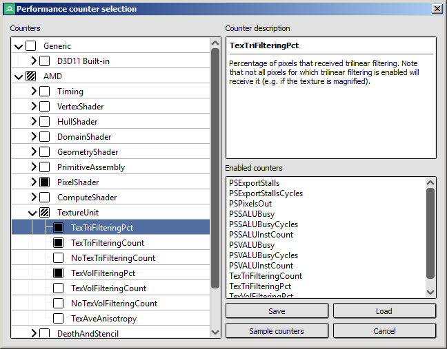
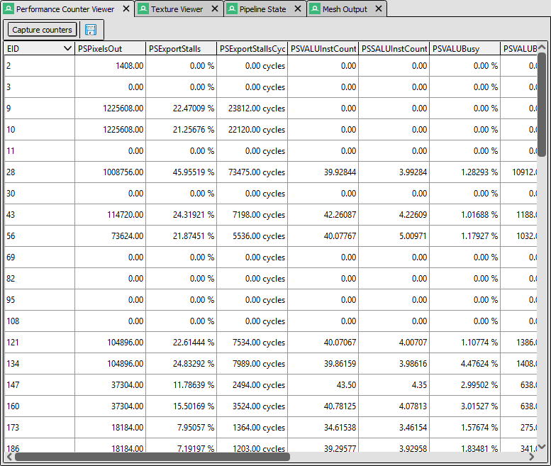

Performance Counter Viewer
==========================

The performance counter viewer provides a very simple way to fetch the results of GPU counters across all events in a capture.

Counter selection
-----------------

Once a capture is opened, clicking the :guilabel:`Capture Counters` button will open up the selection dialog, listing all of the counters available.

	Performance Counter Viewer: Selecting the set of counters.

On the left-hand side will be a tree view with the available counters. These will be grouped in a hierarchy to allow for easier browsing.

When a counter is selected, the counter description will list a brief summary of what value or quantity the counter is measuring and may indicate where it is useful.

Each counter has a checkbox, as well as each category. Counters can be toggled individually, or else whole categories can be toggled on and off at once which enables or disables all counters within that category. On the lower right is a list of all enabled counters - double clicking on any counter will jump to it in the list and display its description.

The set of counters to be sampled can be saved and loaded to a configuration file using the :guilabel:`Save` and :guilabel:`Load` buttons.

Counter Results
---------------

When clicking :guilabel:`Sample Counters` in the counter selection dialog above, RenderDoc will then iterate over every event and fetch all of the data for the selected counters, and display it in a large table.

	Performance Counter Viewer: Viewing the results of the counters.

By default the table is sorted by EID, but each column is sortable individually so that you can easily identify the action with the highest or lowest value for any given counter.

.. |save| image:: ../imgs/icons/save.png

Clicking the |save| button lets you save the results of the counters as CSV.

Hardware Counters
-----------------

RenderDoc ships with support for AMD's GPA library, which will allow access to AMD's hardware counters when running with a supported AMD GPU.

RenderDoc also has support for nVidia's NvPerfKit library, but it does not ship as the library's license forbids redistribution. To enable support, place the ``NvPmApi.Core.dll`` file into either ``plugins/nv/counters/x64`` for 64-bit RenderDoc builds and ``plugins/nv/counters/x86`` for 32-bit RenderDoc builds.

Similarly RenderDoc has support for nVidia's Nsight Perf SDK, but this library's license also forbids redistribution. To enable support, follow these steps:

#. Download the Nsight Perf SDK from: `https://developer.nvidia.com/nsight-perf-sdk <https://developer.nvidia.com/nsight-perf-sdk>`_.
#. Extract the contents
#. On windows copy ``nvperf_grfx_host.dll`` and on linux copy ``libnvperf_grfx_host.*`` to the plugins folder in ``renderdoc/plugins/nv`` in your user directory.
