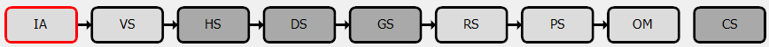

Pipeline State
==============

The Pipeline Viewer is an information dense but simple window in RenderDoc. It shows all of the stateful settings of the graphics pipeline, including bound resources, rasterizer settings, etc.

Pipeline flowchart
------------------

At the top of the Pipeline Viewer is the pipeline flowchart - this shows the high-level block level diagram of the graphics pipeline.

Each block is a separate page which contains the relevant state and contents for that piece of the graphics pipeline, with specific details varying by API and the type of data to be displayed.

The currently selected block is outlined with red, and the page in view reflects the contents of that section of the pipeline. Light gray parts of the pipeline are those which are currently active and participating in this drawcall. Dark gray parts of the pipeline are not enabled and can be considered pass-through/do-nothing.

	Pipeline: Pictured here, the high-level parts of the Vulkan Pipeline.

.. note::

	In D3D11 and OpenGL, the Stream-Out / Transform Feedback stage is available under the Geometry Shader block, with the buffers being used for stream-out shown.

Pipeline Section Display
------------------------

The pipeline state viewer always displays the state of the pipeline _after_ the execution of the drawcall, as with the other viewers in RenderDoc.

Any resources that are bound to the pipeline can be opened in more detailed viewers, such as vertex buffers, constant buffers and textures. More details of this process can be found in the page :doc:`../how/how_object_details`.

.. |page_white_delete| image:: ../imgs/icons/page_white_delete.png

The pipeline view attempts to only show what is relevant, and not all possible stateful data. To do this (when available) it uses shader reflection data to only display slots which are actually in use by the shaders, and omit any that are unused. This can be overridden with the Show Unused Items |page_white_delete| button.

On some APIs like Vulkan it may be common to use 'bindless' approaches where a large number of resources are bound and only a small number are accessed at any time. In these cases RenderDoc uses dynamic feedback to try to determine the set of resources accessed and only displays them. This can similarly be overridden with the Show Unused Items |page_white_delete| button.

Likewise it will omit any slots which are completely empty (and also unused), and this behaviour can be overridden with the Show Empty Items |page_white_database| button.

In some cases whole sections will be omitted unless there is anything set there - this is primarily for unused or rarely used features like shader subroutines/class linkage, and Read/Write bindings (Image load store or UAVs).

Sections can be expanded and collapsed by clicking on the title text above them to toggle them in and out of the collapsed state. This can be used to temporarily close down some sections that you don't need to make room for more vertical space in sections you do need.

When showing disabled or empty entries, they will either be in *italics* or on a dark red background respectively.

.. |save| image:: ../imgs/icons/save.png

You can also export the pipeline state by clicking on the |save| export button, this will export the entire pipeline state in detail to an HTML file, so you can more easily compare between different logs and different events.

See Also
--------

* :doc:`../how/how_object_details`
