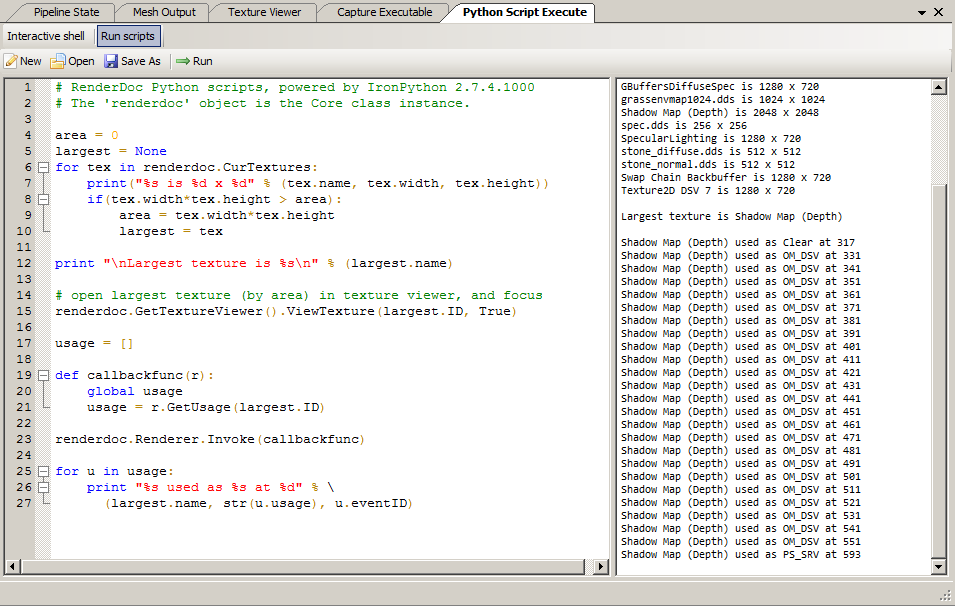

Python Shell
============

The python shell allows flexible of RenderDoc, including the ability to run simple scripts over the whole dataset in ways not easy to do in the UI. Depending on the build-time configuration the Qt UI itself may also be exposed to python for customisation.

Overview
--------

	The python shell

You can open the python shell from the window menu. It offers both an interactive shell and a window that can open and run scripts and display the output.

The full :doc:`python API reference <../python_api/index>` contains the explicit detail of the whole API, but you can also use the ``help()`` command to obtain information about a particular object or function call.

To get started the :code:`pyrenderdoc` object corresponds to a :py:class:`qrenderdoc.CaptureContext` object through which the internal API and UI windows can be obtained.

For Qt integration, if available, you can import :code:`PySide2` which provides python bindings for the Qt API.

See Also
--------

* :doc:`../python_api/index`
* :doc:`../how/how_python_extension`
