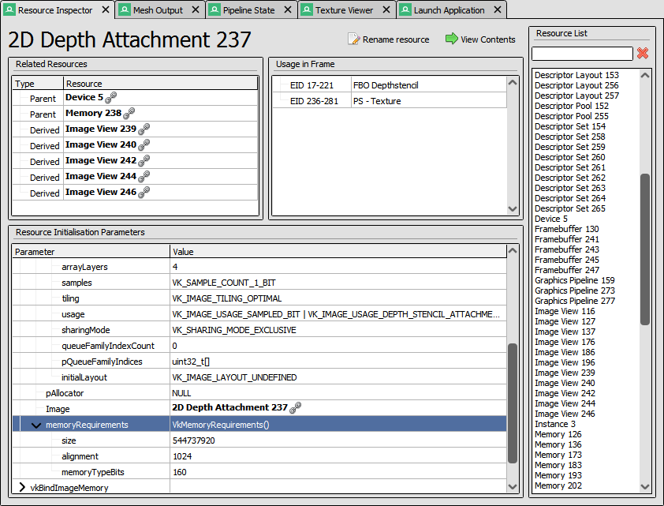
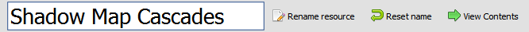

Resource Inspector
==================

The resource inspector window allows you to see a full list of all API objects included in the frame capture. You can see the relationships between objects - such as parent/child links - as well as the full creation details of any object.

.. |link| image:: ../imgs/icons/link.png

Links to the resource inspector exist throughout the UI indicated by a **bold resource name** and the |link| icon.

	Resource Inspector: Examining the details of a resource in a capture.

Related Resources
-----------------

For the selected resource, if there are any parent resources which this resource depends on, they will be listed under related resources. Similarly in the parent resource, any children are listed here too. This lets you easily click from one to the other.

An example of a parent-child relationship is a 'view' type object that is created in reference to a concrete 'image' or 'texture' type object.

Usage in Frame
--------------

Some resources such as textures and buffers have information available about where and how they're used in the frame.

In this list, each entry lists an EID range and a type of usage.

Resource Initialisation Parameters
----------------------------------

Before any API object is used in the frame, it must be initialised and set up exactly as it was in the captured application.

The function calls used to initialise the object are listed here, which will normally contain at least one creation function.

Renaming resources
------------------

To rename resources, click on the :guilabel:`Rename Resource` button next to the name, and it will open an editing textbox to let you change the name. When you've set the name, press :kbd:`Enter` or click :guilabel:`Rename Resource` again. To cancel a rename, press :kbd:`Escape` or click :guilabel:`Reset name` to restore the name to its original value.

This name will be used consistently throughout the UI anywhere the resource is referenced, and will update whenever you rename it again.

	Resource Inspector: Renaming a resource in a capture.

For more information, see :doc:`../how/how_annotate_capture`.
