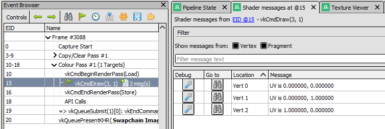

Shader Messages
===============

The Shader Messages window shows messages obtained from shader prints in a given action.

When selecting an action you have the option to open the list of messages, which can be viewed in this window and filtered/processed.

.. note::

  Currently this feature requires API support and is only implemented on Vulkan. If in future other APIs gain support for it they will be supported in the same way.

Adding shader prints
--------------------

The exact mechanism for printing from shaders varies by API, so it is best to consult the documentation for each API for more information.

For Vulkan the SPIR-V extension ``NonSemantic.DebugPrintf`` is used to list printfs which are ignored by drivers but can be processed by tools like RenderDoc. This is exposed in GLSL via the ``GL_EXT_debug_printf`` extension and ``debugPrintfEXT()`` function, and in HLSL via the ``printf`` built-in function.

Fetching shader messages
------------------------

Shader messages are not fetched for the whole capture at once, they are fetched on a per-action basis when that action is selected. If any messages appear they will be shown in the event browser next to the action, with a link that opens the shader message viewer for those messages. The messages can also be found linked from the pipeline state under each shader stage, which will pre-filter for only messages from that stage.

Shader Messages
---------------

The window itself is relatively simple. Each message retrieved from the api will be listed on its own row showing the shader invocation that printed the message along with its contents. The location itself will vary depending on the type of shaders - for vertices this will identify the instance and vertex, for pixels this will be the co-ordinate and sample, for compute threads this will be the group and thread.

For non-compute shaders each row has two buttons, one to go to the particular invocation (the pixel, or the vertex) and the other to debug the invocation. Clicking debug will set a breakpoint on the print statement and run to it immediately. For compute shaders the only option is to debug.

.. note::

  Shaders which can't be debugged due to unsupported functionality may still produce print statements. In this case they still cannot be debugged.

The messages can be filtered by text substring in the filter box, as well as by shader stage using the toggles.

Double clicking on any row will take you to the corresponding event ID in the event browser.

	Shader Messages: The Shader Messages window showing some simple prints from a vertex shader.

Shader Edits
------------

Since prints come from shaders, the expectation is that they are fixed for a given action and so they are cached and not re-fetched each time the action is selected.

However this doesn't hold if the shader is edited, since the print could change or the control flow and inputs could change. When this happens any previous shader messages windows will show up as 'stale' until the action is selected where they will refresh themselves with the latest messages. If the action is already selected then the messages will update immediately.
