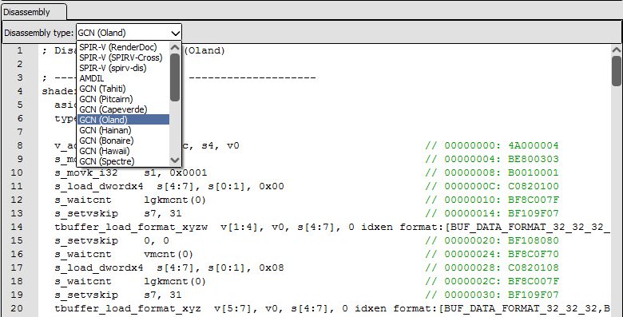

Shader Viewer
=============

The Shader Viewer is used for displaying, editing, and debugging shaders.

Information about editing shaders can be found in other documents such as :doc:`../how/how_edit_shader` and :doc:`../how/how_custom_visualisation`.

Debugging shaders is documented in :doc:`../how/how_debug_shader`.

Overview
--------

.. figure:: ../imgs/Screenshots/ShaderViewer.png

	The shader viewer displaying a D3D11 shader

When opened from the :doc:`pipeline_state` for a given shader stage, the shader viewer display the shader itself as well as the input and output signatures. These signatures form the interface between this shader stage and the previous and next parts of the rendering pipeline. For example a vertex shader will list the fixed function vertex inputs, and the interpolated values that are passed to the next stage.

The shader viewer displays the source code in the formats that are available. When debugging information has embedded it there will be tabs for each original source file. For APIs using a bytecode IR the disassembly of that bytecode will also be displayed in a separate tab.

Several different disassembly forms are possible, depending on the API and available plugins and hardware support. Above the disassembly tab will be a drop-down listing the possible representations including hardware specific ISA formats like AMD GCN.

You can configure shader processing tools :ref:`in the settings window <shader-processing-tools-config>` which allows for various customised disassemblers such as SPIRV-Cross and spirv-dis for SPIR-V.

	The disassembly options for a Vulkan SPIR-V shader
