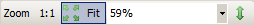
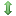

Texture Viewer
==============

The texture viewer is likely the most intuitive window in RenderDoc and commonly the most regularly used. It displays the contents of any texture in its current state at the given event, as well as providing controls to adjust and inspect it in different ways.

Overview
--------

The texture viewer consists of a couple of different sections, which will be outlined here.

Several specific techniques or features used within the texture viewer have their own separate pages that go into more detail. You might find more useful information there if they cover what you are looking for: :doc:`../how/how_view_texture`, :doc:`../how/how_inspect_pixel`, :doc:`../how/how_custom_visualisation`

.. figure:: ../imgs/Screenshots/LabelledTexViewer.png

  Texture Viewer: A labelled diagram showing the different parts of the texture viewer.

Main Texture Display
--------------------

The main texture display takes up the largest portion of the window, and is simply a container for the textures to display.

It is a tabbed control and although one tab is always present showing the currently followed texture bound to the pipeline, other locked tabs can be opened up showing a single resource. More details are available on the page :doc:`../how/how_view_texture`.

The mouse wheel can be used to zoom in and out of the texture. When zoomed in, holding the left mouse button and dragging will pan the image from side to side.

While over the image the status bar will show the current pixel that the mouse is over. Clicking or holding the right mouse button will pick this pixel and show its information in the status bar. More information is available on the page :doc:`../how/how_inspect_pixel`.

Information Status Bar
----------------------

The status bar below the main texture display contains information on the currently visible texture.

* The name (if available - if not an auto-generated name will be used).
* Dimensions - Width, height, depth and array size as applicable.
* Mip Count.
* MSAA sample count and quality, if applicable.
* Format - e.g. RGB8. The exact phrasing of this will vary by API.

After this information there are a few displays that are pixel-based. The pixel that is under the cursor is displayed as a colour swatch, followed by its co-ordinates. Then any :doc:`picked pixel <../how/how_inspect_pixel>` is displayed afterwards with its numeric value displayed.

.. figure:: ../imgs/Screenshots/RMBStatus.png

  Picked Pixels: Detailed information about the current pixel.

Thumbnail Strips
----------------

There are several thumbnail strip panels available, by default they are docked in the same location such that they are tabbed together, but they can be displayed side by side.

These strips display thumbnails of the resources bound to their respective parts of the pipeline, to give some context and allow quick preview without having to switch the main display between these textures.

The texture that the following tab is currently displaying is highlighted in red, and each thumbnail shows both the slot number and the name of the texture bound at that point. To follow a given slot simply left click on it. If the currently followed texture slot is empty (i.e. it was following a texture and then that slot was unbound) it will show up simply named "Unbound" and with no name or slot number.

Each thumbnail has a context menu available via right click. This menu allows you to open a locked tab (:doc:`../how/how_view_texture`), as well as containing a list of all the uses of this texture - as read-only resource and writable output. This is similar to the resource display strip on the :doc:`timeline_bar`. Clicking on any of these entries will jump to the first of the events in the event range listed.

.. figure:: ../imgs/Screenshots/OpenLockedTab.png

  Thumbnail Menu: Thumbnail context menu with several options.

There are also two general options - show disabled and show empty. These behave the same as the options in the :doc:`pipeline_state` window - temporarily overriding the default behaviour in RenderDoc to only show texture slots that are referenced in the shader.

Pixel Context Display
---------------------

The Pixel context display is a small panel by default in the bottom right of the texture viewer.

Whenever a pixel is picked small area of the texture around it is rendered at maximum zoom to this panel. This gives you some context for the pixels nearby to the one you're picking and allows fine refinement without needing to zoom in and lose your place in the overall image.

.. figure:: ../imgs/Screenshots/PixelContext.png

  Pixel context: Pixel context displaying the surrounds of the picked pixel.

From here, once you have selected a pixel, you can also launch the :doc:`pixel debugger <../how/how_debug_shader>` if you have the drawcall that you want to debug selected. You can also launch the :ref:`pixel-history` view which shows all modifications that have happened to the texture since the start of the frame to the currently selected event.

Visible Range Control
---------------------

The visible range or range adaption control is very useful in easing display and inspection of images with a very narrow range of values, and is necessary for viewing any HDR images as it can be used to map a larger range down to LDR for display.

.. figure:: ../imgs/Screenshots/RangeControl.png

  Range control: The range control narrowing the visible range mapped to [0,1] on output.

The primary controls are the black point and white point. These are shown in two text boxes at either side of the main range control. These are the current absolute black and white values - these values in the input texture are mapped to 0 and 1 respectively on output.

The range control itself has a black point and a white point that can be adjusted simply by clicking and dragging. These allow finer and more interactive adjustments. These handle only allow you to adjust the extremes within the range defined by the absolute black and white points in the text box.

There are four other buttons available for control of the range:

.. |zoom| image:: ../imgs/icons/zoom.png
.. |wand| image:: ../imgs/icons/wand.png
.. |UndoArrow| image:: ../imgs/icons/UndoArrow.png
.. |chart_curve| image:: ../imgs/icons/chart_curve.png

* |zoom| **Zoom in** - This button will zoom the extreme values in to whichever fine values have been selected by the draggable handles.

  This is primarily useful when starting from some large range and using the handles to drag down to a more reasonable range, you can click zoom to then reduce the range down to just the one selected, so you can again get fine control.

  .. figure:: ../imgs/Screenshots/BeforeRangeZoom.png

    Before: The range control before zooming.

  .. figure:: ../imgs/Screenshots/AfterRangeZoom.png

    After: The range control after zooming.

* |wand| **Autofit** - This button automatically fits the range control to the min and max values in any visible channels in the texture. Oftentimes this is a good starting point for a range, although with some extreme textures it may adjust badly.

  Right clicking on this button will cause it to always auto-fit until you disable this. ie. when you move to another event or another texture, the range will be auto-fit again. This is useful if jumping between events or textures where the visible ranges are very different.

* |UndoArrow| **Reset** - Simply resets the range back to the default of [0, 1] - useful for resetting after changing to a new texture where the range settings aren't applicable.

* |chart_curve| **Histogram** - This is a toggle switch. When enabled it will change the thin bar of the range control into a thicker bar that contains a range-value histogram, showing the distribution of values.

  The histogram is based on the straight numerical mean of all visible channels, and will update as the white and black points move.

  .. figure:: ../imgs/Screenshots/RangeHistogram.png

    Values Histogram: A histogram showing the range distribution of values in the image.

Toolbar
-------

The toolbar contains most of the tools for selecting which mip, slice, face of a texture to view as well as how to display it and if any transformations or overlays should be applied.

.. note::

  The channel selection, and mip/slice selection, are stored by default as a per-texture state. In other words if you display a render target with only the alpha channel visible, then switching to view another texture will default back to RGB - and switching back to that render target will view alpha again.

  Also visible range/range adaption control is detailed in the section above and will not be covered here.

Channels selector
~~~~~~~~~~~~~~~~~

.. |RGBAChannels| image:: ../imgs/Screenshots/RGBAChannels.png
.. |RGBMChannels| image:: ../imgs/Screenshots/RGBMChannels.png
.. |CustomDisplay| image:: ../imgs/Screenshots/CustomDisplay.png
.. |add| image:: ../imgs/icons/add.png
.. |page_white_edit| image:: ../imgs/icons/page_white_edit.png
.. |delete| image:: ../imgs/icons/delete.png

..

  | |RGBAChannels| Default RGBA channels
  | |RGBMChannels| RGBM mode
  | |CustomDisplay| |add| |page_white_edit| |delete| :doc:`Custom Shader mode <../how/how_custom_visualisation>`

This selector switches between displaying standard RGBA channels, RGBM encoding with a custom multiplier and using a custom visualiser shader.

When in **RGBA** mode, by default only the RGB channels are displayed and alpha is forced to fully opaque. Each of the channels can be toggled off independently and any combination can be used. Any RGB channel which is disabled is forced to fully black in the output. When Alpha is enabled, the background will be rendered with a solid colour or checkerboard pattern to indicate semi-transparent areas.

Also note that when a single channel is displayed solo, the image is rendered as grayscale in that channel rather than displaying a monochromatic coloured image.

.. tip::
  Right clicking on one of the channel buttons in the texture viewer (R, G, B, A) will either select only that channel, or if it's already the only one selected it will select all of the others. This is useful e.g. to toggle between viewing RGB and alpha, or for looking at individual channels in a packed texture or render target.

Note that these channel selections are by default saved as per-texture state, so switching to a different texture will revert back to the default RGB, but going back to the first texture will remember which channels you were viewing. See the option in the :doc:`options_window`.

When **RGBM** is selected, the RGB value will be multiplied by the specified multiplier and then by the alpha value. This is a common encoding used to pack a larger range into an 8-bit RGB image.

With **Custom** selected a dropdown will be populated with any ``.hlsl`` or ``.glsl`` files as appropriate in the ``%APPDATA%\renderdoc`` folder. When choosing a custom shader the raw image will be passed through this shader before being displayed with the usual controls on the main display.

You can create a new custom shader with the |add| button, edit a shader with the |page_white_edit| button, and delete an one with the |delete| button.

Gamma display of Linear Data
~~~~~~~~~~~~~~~~~~~~~~~~~~~~

  | γ Gamma display

A proper explanation of this is available in the :ref:`FAQ <gamma-linear-display>`. In short, linear data is 'overcorrected' to look as expected, but this behaviour can be overridden by toggling off this option.

Alpha background
~~~~~~~~~~~~~~~~
.. |color_wheel| image:: ../imgs/icons/color_wheel.png
.. |crosshatch| image:: ../imgs/icons/crosshatch.png

..

  | |color_wheel| Choose background color
  | |crosshatch| Checkerboard background

When displaying a texture with alpha channel, the background of the main display changes to make the semi-transparent sections more obvious. With these two controls you can either choose a checkerboard pattern |crosshatch| or open a colour picker to choose a solid colour |color_wheel|.

The currently enabled mode will be highlighted.

Subresource selection
~~~~~~~~~~~~~~~~~~~~~
.. |SubresourceSelect| image:: ../imgs/Screenshots/SubresourceSelect.png

..

  | |SubresourceSelect|

The main display of the texture viewer can only display at most a single 2D image at once.

For textures with mip-maps this control allows you to select the mip level to display - the overall size of the image will remain the same but will be point sampled from the given mip level.

For 3D textures and 2D arrays you can select the slice to display here from the drop-down, and for cubemaps you can select the face. For cubemap arrays these two controls are combined to show a list of the faces for the first cubemap, then the second, etc.

For Multisampled textures, this will allow you to select either a single sample to view across the image, or to see a default-resolved image.

Note that these selections are by default saved as per-texture state, so switching to a different texture will revert back to the default first slice or face, and top mip. Going back to the first texture though will remember which subresource you were viewing. See the option in the :doc:`options_window`.

Save Texture
~~~~~~~~~~~~

.. |save| image:: ../imgs/icons/save.png

..

  | |save| Save Texture

This allows you to save the currently visible texture. Several formats are supported including ``.dds``, ``.exr``, and options are available for mapping down complex formats (such as multisampled or 3D textures) to formats that don't support them such as ``.png`` or ``.jpg``.

Open Texture List
~~~~~~~~~~~~~~~~~

.. |page_white_link| image:: ../imgs/icons/page_white_link.png

..

  | |page_white_link| Open Texture List

This button opens the texture list of all textures present in the capture. More details can be seen in :doc:`../how/how_view_texture`.

View Texture as Buffer
~~~~~~~~~~~~~~~~~~~~~~

.. |page_white_code| image:: ../imgs/icons/page_white_code.png

..

  | |page_white_code| Open Texture data in Buffer Viewer

This button opens the texture in the :doc:`raw buffer viewer <buffer_viewer>`. This lets you see the raw data of the underlying texture and format it as you wish if the data represents more complex data than is easy to display in the texture viewer.

.. warning::

  The buffer viewer may not be able to handle the full number of columns that are appropriate for the full width of a texture, so it is better to limit the number of columns and manually calculate the offset into the table of data.

Goto Location
~~~~~~~~~~~~~

.. |find| image:: ../imgs/icons/find.png

..

  | |find| Goto pixel location

This button opens a small popup above the main texture view that lets you type in a pixel location to jump to. This is useful if you're investigating a particular issue where you know what pixel the problem will lie on.

.. note::

  This popup is also available with the keyboard shortcut :kbd:`Ctrl-G`.

Zoom Controls
~~~~~~~~~~~~~~~~~

.. |fit_window| image:: ../imgs/icons/fit_window.png

..

  | |ZoomControls|

The zoom controls are fairly self explanatory - a pre-existing zoom value can be chosen from the drop down or a custom value (clamped to the minimum and maximum zoom) can be entered as a percentage. Click the ``1:1`` button to zoom to the exact size.

To automatically fit the texture to the space available in the window, regardless of its dimensions, you can click the |fit_window| Fit button.

Flip Y
~~~~~~

..

  | |flip_y| Flip Y

This button toggles flipping the co-ordinate system in Y - y=0 is at the bottom of the window instead of at the top.
  
.. _render-overlay:

Render Overlay
~~~~~~~~~~~~~~

.. |OverlaySelect| image:: ../imgs/Screenshots/OverlaySelect.png

..

  | |OverlaySelect|

This is a powerful tool for quickly diagnosing issues and can be very useful for locating what you're looking for. Several overlays are available that can be rendered over any texture, although most of them are only meaningful for currently bound render targets.

* ``Highlight Drawcall`` will do pretty much as it says. It darkens everything except the current drawcall which is highlighted in flat colour. This makes whatever is being drawn stand out and can be useful for seeing where the current object is on screen, especially if rapidly browsing through the frame.

* ``Wireframe Mesh`` will render a wireframe mesh of the current drawcall over the top of the image.

* ``Depth Test`` will render an overlay over the drawcall, with red sections covering any part of the drawcall that never passed the depth test, and green sections covering areas that did pass the depth test. Note that if the drawcall overdraws itself then as long as at least one pass over a pixel passes the depth test then that pixel will be green.

* ``Stencil Test`` performs similarly to the depth test, but for the stencil test.

* ``Backface Cull`` works as above but with backface culling.

* ``Viewport/Scissor`` shows a coloured overlay on the image that corresponds to the viewport and scissor regions.

* ``NaN/Inf/-ve display`` will render the image in grayscale (using the typical luminance calculation - ``dot(col.xyz, float3(0.2126, 0.7152, 0.0722)).xxx``) with red pixels highlighting any NaNs found, green pixels highlighting any infinities, and blue pixels for any negative values. Note that in any case where only one or some channels in a multi-channel texture pass, that pixel will still be highlighted (so ``{0.5, -1.0, 0.0}`` would highlight blue).

* ``Clipping`` will simply highlight in red any values that are below the current black point (as defined by the range control - see above), and in green any values above the white point. This can be useful in identifying invalid ranges if the range control is adjusted correctly, or in combination with a custom shader visualiser.

* ``Clear before Pass`` will act as if the current target had been cleared to black right before the current pass. This can sometimes make it easier to see the results of a draw, especially if it is blending and only makes a subtle change. If the current API does not have the concept of a pass, it is defined as all the drawcalls with the same set of render targets.

* ``Clear before Draw`` works similarly to the above overlay, but clearing immediately before the selected draw.

* ``Quad Overdraw (Pass)`` will show a visualisation of the level of 2x2 quad overdraw in the 'pass' up to the selected draw. If the current API does not have the concept of a pass, it is defined as all the drawcalls with the same set of render targets.

* ``Quad Overdraw (Draw)`` will show a similar visualisation to the above option, but limited only to the current drawcall.

* ``Triangle Size (Pass)`` will show a visualisation of how much pixel area triangles in the meshes are covering in the 'pass' up to the selected draw, up to 4x4 pixels (16 square px) at most. If the current API does not have the concept of a pass, it is defined as all the drawcalls with the same set of render targets.

* ``Triangle Size (Draw)`` will show a similar visualisation to the above option, but limited only to the current drawcall.

.. note::

  These overlays are all rendered after most image controls are applied. For this reason the range control, channel controls and custom shaders do not affect the overlays.

See Also
--------
* :doc:`../how/how_view_texture`
* :doc:`../how/how_inspect_pixel`
* :doc:`../how/how_custom_visualisation`.
