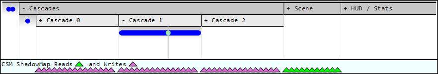
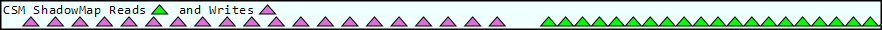
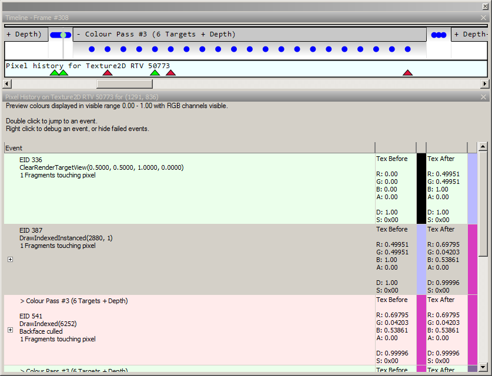

Timeline Bar
============

The timeline bar shows an alternate view of the scene to the :doc:`event_browser`. Displaying the scene with time running as the horizontal axis, although it does not show each section in size relative to its timing.

Introduction
------------

The timeline bar shows the scene horizontally with the hierarchical frame markers being expandable from top to bottom.

This alternate view can be a useful way to get an overview of the whole frame, allowing you to jump around very different parts of the frame.

Given that the timeline bar shows the whole frame it also provides a secondary function of showing dependencies in a global way. For whichever texture is currently selected in the texture viewer, pixel history, or resource inspector, the timeline bar shows accesses of that texture throughout the frame. This can be especially useful for render targets that are cleared, written to and read from, as well as simply to see where a given texture is used in a frame without laboriously searching.

	Timeline Bar: The timeline bar showing a birds-eye view of a typical application.

Timeline Display
----------------

By default the timeline bar views the whole frame, but with the mouse wheel you can zoom in and out. When zoomed in, you can scroll through the frame with the horizontal scroll bar.

Underneath expanded sections, a blue pip is rendered for each drawcall-type event. The currently selected event is shown as a green pip, as well as there being a light gray vertical line to indicate the current position, such that this is visible even when the relevant section is not expanded.

Clicking on any section will toggle it between expanded and unexpanded, and any sections underneath a section which is collapsed will remain in their previous state but will not be visible.

Left clicking on the timeline will jump to the event underneath that point on the horizontal display.

Resource usage Display
----------------------

The timeline bar also shows the usage of the currently displayed texture.

If the :doc:`texture_viewer` is active then whichever texture is being displayed will have its usage laid out across the frame on the timeline bar. If the :doc:`resource_inspector` is active then whichever resource is currently being inspected will have its usage displayed.

If your textures have their names annotated you will see which texture is being inspected in the label for the usage bar.

A colored triangle will be drawn under each pip that reads from the texture. If the pips are too close together some triangles may be hidden, so zoom in anywhere that there is a great deal of usage in a small place to make it more visible.

	Resource Usage: The usage bar showing reads and writes to a texture.

Pixel history event Display
---------------------------

When a pixel history window is focused, the timeline bar will show the results over each EID with a red triangle to show rejected pixels and green triangles to show passed pixels.

	Pixel History Results: The timeline bar shows the results of a pixel's history.
